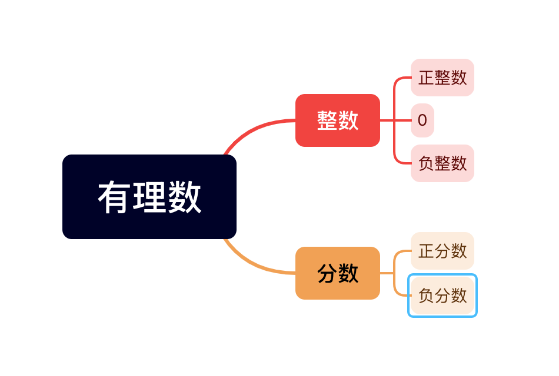
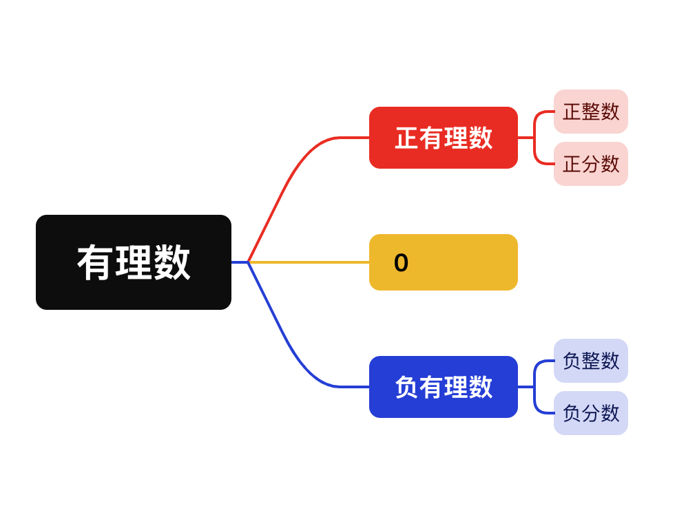

# 第一章 有理数

## 1.1 正数和负数

1. 在数学中，像3，5，0，7.8%这样大于0的数叫做正数。像-3，-10，-0.7%这样在正数前加上“-”的数叫做负数，其中符号“-”是负号，读作负。有时为了明确表达与负数的相反意义，在正数的前面也加上符号“+”（读作“正”）。
2. 0既不是正数，也不是负数。０是正数与负数的分界。
3. 如果一个问题中出现具有相反意义的量，就可以用正数和负数分别表示它们。

## 1.2 有理数及其大小比较

### 1.2.1 有理数的概念

1. 正整数、０、负整数统称为整数。
2. 正分数、负分数统称为分数。
3. 有限小数和无限循环小数都可以化为分数，因此它们也可以看成分数。
4. 可以写成分数$\frac nm$（m，n是整数）形式的数称为有理数（rational number）。其中，可以写成正分数形式的数为正有理数，可以写成负分数形式的数为负有理数。
5. 整数和分数统称为有理数。
6. 有理数：可以写成两个数之比的数。
7. 有理数的分类
    1. 按定义分类
    
    
    
    1. 按符号分类
    
    
    
8. 一些具有确定性质的对象的全体。

### 1.2.2 数轴

1. 数缺形时少直观，形少数时难入微。
2. 规定了原点、正方向和单位长度的直线叫作数轴（number axis）。
3. 原点将数轴（原点除外）分成两部分，其中正方向一侧的部分叫作数轴的正半轴；另一侧的部分叫作数轴的负半轴。
4. 数轴的画法、步骤：
    1. 画一条直线，在直线上任取一点表示数0，这个点叫做原点。（ 原点作用：原点是数轴的基准点。）
    2. 通常规定，直线上从原点向右（或上）为正方向，从原点向左（或下）为负方向。
    3. 选取适当的长度为单位长度，直线上从原点向右，每隔一个单位长度取一个点，依次表示1， 2， 3 …（通常将数字标注在直线下方）；从原点向左，用类似方法依次表示-1， -2， -3…
5. 每个有理数，都能在数轴上找到一个相应的点。
数轴上的点不一定是有理数。
6. 数轴：规定了原点、正方向、单位长度的一条直线
    1. 数轴三要素：原点、正方向、单位长度
    2. 注意：数轴三要素，缺一不可
7. 一般地，设a是一个正数，则数轴上表示数a的点在数轴的正半轴上，与原点的距离是a个单位长度；表示数-a的点在数轴的负半轴上，与原点的距离是a个单位长度。数轴上与原点的距离是a个单位长度的点，简称为数轴上与原点的距离是a的点。

### 1.2.3 相反数

1. 只有符号不同的两个数，叫做互为相反数。
2. 相反数的相反数是本身。
3. 两个互为相反数的数，关于原点对称。
4. ０的相反数是０。
5. a和-a互为相反数。这里，a表示任意一个数，可以是正数、负数，也可以是０。
6. 任何一个数都有相反数。
7. 多重符号化简：（负号：相反数的运算符。）
    1. 一个正数前面不管有多少个“+”号，都可以全部省去不写。
    2. 一个正数前面有偶数个“-”号，则化简后把“-”号一起去掉。
    3. 一个正数前面有奇数个“-”号，则化简后只保留一个“-”号。

### 1.2.4 绝对值

1. 数轴上表示数a的点与原点的距离叫作数a的绝对值，记作|a|。
2. 一个正数的绝对值是它本身；一个负数的绝对值是它的相反数；０的绝对值是０。即
    1. 如果a＞０，那么a＝a；
    2. 如果a＝0，那么a＝０；
    3. 如果a＜０，那么a＝-a。
3. 任何一个有理数a的绝对值总是非负数，符号表示|a|≥0。
4. 互为相反数的两个数的绝对值相等。
5. 绝对值等于它本身的数有正数和0，绝对值等于它的相反数的数有负数和0。

### 1.2.5 有理数的大小比较

1. 数轴上的点从左到右的顺序，就是对应的数从小到大的顺序（左边的数<右边的数）。
2. 正数大于０，０大于负数，正数大于负数；
3. 大小比较：先考虑正负。同号两数，看绝对值。正数与正数，绝对值大的就大。负数与负数，绝对值大的就小。
