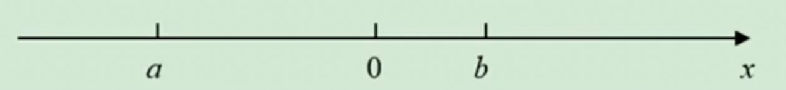

# 1.2.4 绝对值练习题

例1：求值：
（1）-|-3.7|；
（2）|-（-（-（-（-（-（-（-（-3））））））））|。

答案：（1）-3.7，（2）3

例2：已知|a|=5，求a的值。

答案：±5

例3：已知|a-5|=2，求a的值。

答案：7或3

例4：已知|x|=|x+6|，求x的值。

答案：-3

例5：已知|a-2|+|4-b|=0，求a+2b的值。

答案：10

### 拓展篇

例1：己知x<-3，化筒|3+|2-|1+x|||。

答案：-x

例2：如图，化简|a+b|+|b-a|+|b|-|a-|a||。

答案：b

例3：求$\frac{a}{|a|}+\frac{b}{|b|}+\frac{ab}{|ab|}$的所有可能取値。

解：a≠0，b≠0

①a>0，b>0时，ab>0

原式=1+1+1=3

②a<0，b<0时，ab>0

原式=（-1）+（-1）+1=-1

③a>0，b<0时，ab<0

原式=1+（-1）+（-1）=-1

④a<0，b>0时，ab<0

原式=-1+1+（-1）=-1

综上，所有可能取值为3和-1。

例4：设a、b、c均为整数，且$|a-b|^{19}+|c-a|^{99}=1$，求|c-a|+|a-b|+|b-c|的值。

答案：2

例5：解方程|2x-3|=2

答案：$\frac 52$或$\frac12$

例6：解方程|x-1|=2x。

答案：$\frac13$

例7：解方程|2x-3|=|7-3x|。

答案：2或4

例8：化简|x-2|+|x-3|，并求出x变化时，原式的最小值。

解：x≥3时，原式=x-2+x-3=2x-5

2≤x<3时，原式=x-2+(3-x)=1

x< -2时，原式=2-x+(3-x)=5-2x

即  原式=$\begin{cases}
2x-5\ \ \ \ \ \ \ \ x≥3\\
1\ \ \ \ \ \ \ \ \ \ \ \ \ \ 2≤x<3\\
5-2x \ \ \ \ \ \ \ \ \ x<2
\end{cases}$

当2≤x≤3时，|x-2|+|x-3|最小，最小值为1

例9：求|x-2|+|x-3|+|x-4|的最小値。

答案：当x=3时，最小值为2

例10：设a<b<c<d，求|x-a|+|x-b|+|x-c|+|x-d|的最小值。

答案：当b≤x≤c时，最小值为(d-a)+(c-b)

例11：已知a、b是两个给定的正数，若x在某一特定范围a≤x≤b内任意变动时，都有|1-2x|+|1-3x|+|1-5x|的值恒为常数，求这个常数的值。

解：原式=|2x-1|+|3x-1|+|5x-1|

$=\begin{cases}
10x-3\ \ \ \ \ \ \ \ x≥\frac12\\
6x-1\ \ \ \ \ \ \ \ \frac13≤x≤\frac12\\
1 \ \ \ \ \ \ \ \ \ \ \ \ \ \ \ \ \ \frac15≤x<\frac13\\
3-10x \ \ \ \ \ \ \ \ \ x<\frac15
\end{cases}$

常数的值为1，$\frac15≤a<b≤\frac13$