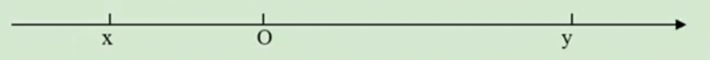

# 1.2.5 有理数的大小比较练习题

例6：比较大小：
（1）-3与7；
（2）-7与3；
（3）$-\frac{5}{13}$与$-\frac{5}{17}$

（4）$-\frac13$与-0.3333

答案：（1）<（2）<（3）>（4）<

例7：如图，下列判断正确的是（  ）

A. x > y

B. |x| < -y
C. х < -У
D. -x < y

例8： 已知|x|=x，|y|=-y，且|x|＞|y|＞0，请将x、-x、y、-y从小到大排序。