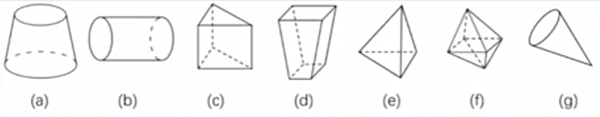
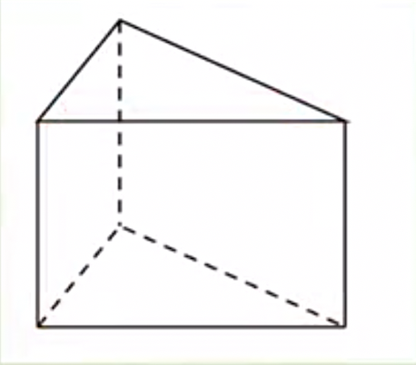

# 6.1.1 立体图形与平面图形练习题

例1：下列几何图形中，是平面图形的是(   )

答案：C

例2：下图中，柱体有____个，其中____是圆柱，____是棱柱。椎体有____个，其中____是圆锥，____是棱锥。

答案：2，(b)，(c)，2，(g)，(e)

例3：对下列四个图形，你可以想到哪些分类方法？

答案：1.柱体：①③④，锥体：②；2.旋转体：①②，多面体③④。

### 三视图

例4：如图，从正面看左下角的几何体，得到的图形是(    )。

答案：B

例5：请作出下列图形的主视图（从正面看）、俯视图（从上面看）和左视图（从左面看）。

例6：用若干个边长为1的小正方体搭一个几何体，若搭成的几何体从正面和从上面看到的形状如图，则这个几何体可能是：

答案：C