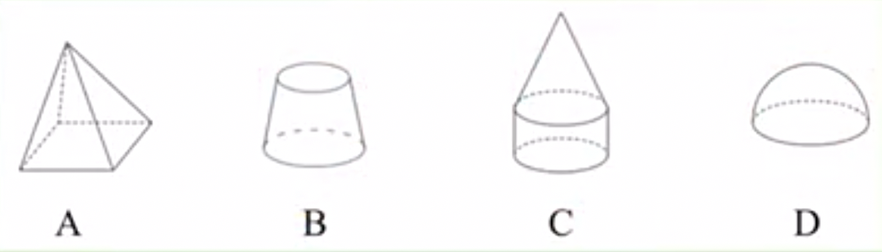
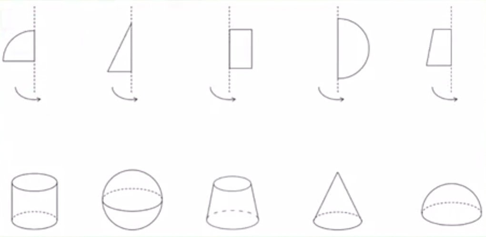
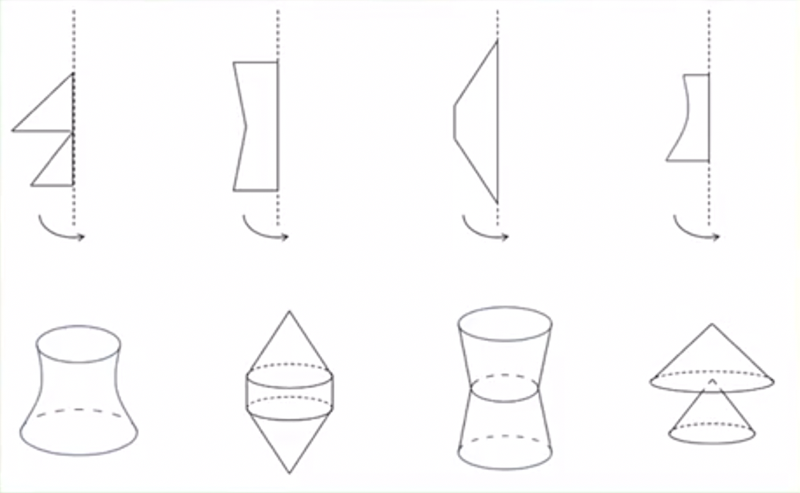
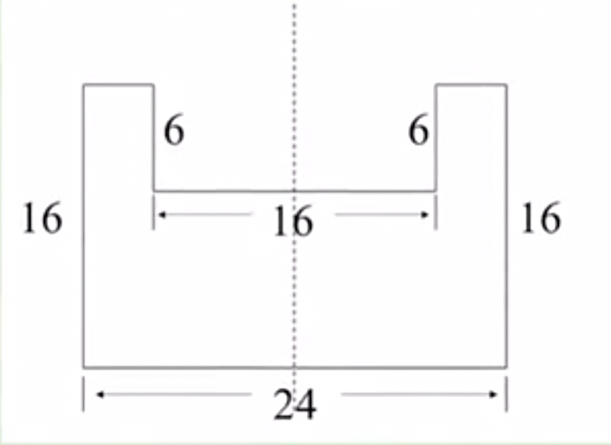
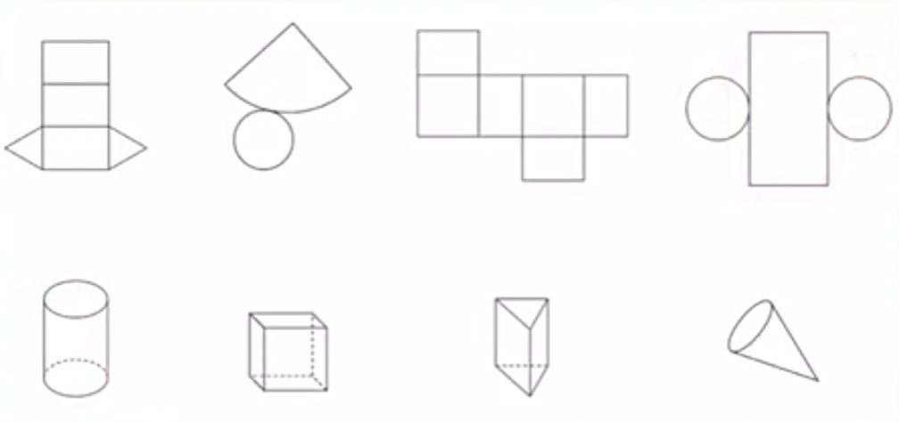
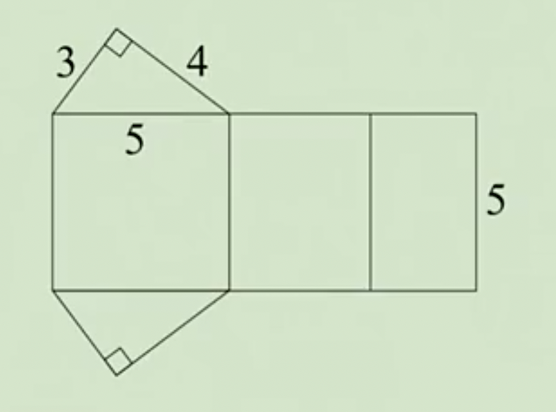
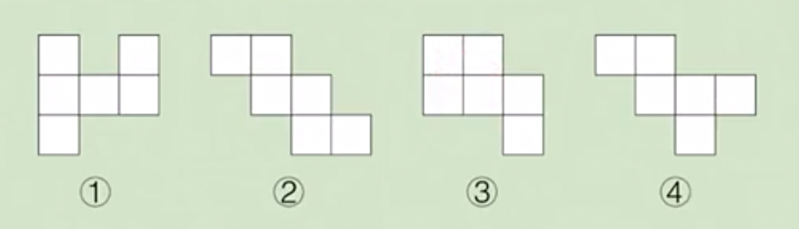
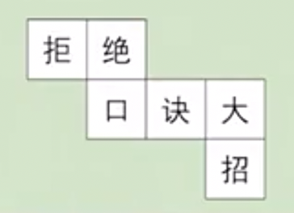
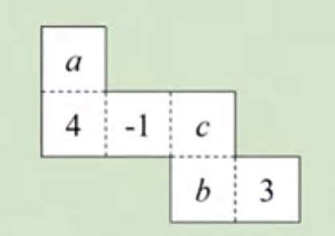

# 6.1.2 点、线、面、体练习题

例1：生活中以下现象：
①流星划过天际；
②硬币立在桌面上旋转；
③时针在钟面上旋转；
④雨刮器刮车窗；
⑤旋转门旋转打开；
⑥一滴雨落下。
其中“点动成线”的有---；“线动成面”的有---；“面动成体”的有---。

答案：①⑥；③④；②⑤。

例2：下列立体图形中，不能由一个平面图形旋转得到的是(   )

答案：A

例3：如图，上面的图形绕轴旋转一周，可以得到下面的立体图形，请把有对应关系的平面图形与立体图形连接起来。

例4：如图，上面的图形绕轴旋转一周，可以得到下面的立体图形，请把有对应关系的平面图形与立体图形连接起来。

例5：将下图中的图形绕虚线旋转一周，得到的几何体的体积是多少？

例6：上面的图形分别是下面哪个立体图形展开的形状？把它们用线连起来。

例7：如图，是一个棱柱的平面展开图，求这个棱柱的表面积。

答案：72

例8：下图中，哪些是正方体的展开图？

答案：②④

例9：将下面正方体的展开图还原，折叠成一个正方体后，与“绝”字相对的面上的字是哪个？

答案：招

例10：如图所示，要使图中平面展开图按虛线折叠成正方体后，相对面上两个数之和相等，求a+b+c的值。

答案：a+b+c=0