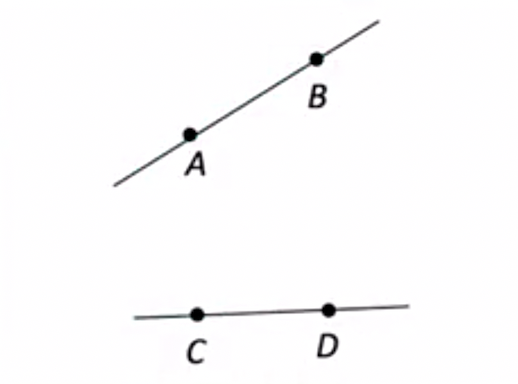
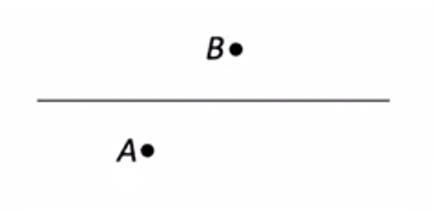
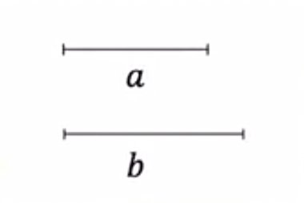
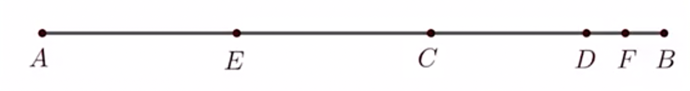

# 6.2.1 直线、射线、线段练习题

例1：判断下列说法是否正确：
（1）直线AB与直线BA是同一条直线；
（2）线段AB与线段BA是同一条线段；
（3）射线AB与射线BA是同一条射线；
（4）一根拉紧的线是一条直线；
（5）若点P在线段AB的延长线上，则点P在线段BA的反向延长线上。

答案：（1）√；（2）√；（3）×；（4）×；（5）√。

例2：判断下列作图语句是否正确：
（1）延长射线AB到C，使BC=2AB；
（2）取直线AB的中点；
（3）在线段AB的延长线上作点P，使AB=BP。

答案：（1）（2）（3）。

例3：如图，下列说法正确的是(   )
A：线段AB与线段CD相交
B：直线AB与线段CD相交
C：射銭AB与射线CD相交
D：射线BA与射线DC相交

例4：（1）两条直线相交，交点个数可能是几个？
（2）三条直线两两相交，交点个数可能是几个？

例5：如图，请在直线上找一点P，使线段AP与线段BP的长度之和最小。

例6：同一平面上4条直线，最多有几个交点？

答案：6个

例7：同一平面上4条直线，最多将平面分成几个部分？

答案：11个

## 尺规作图

例8：下列属于尺规作图的是(   )
A：画线段AB=5厘米
B：测量线段AB的长，画线段CD，使AB=CD
C：A,B,C是直线$l$上的点，在线段BC延长线上，作点D，使CD =AB
D：以点O为圆心，3为半径作一个圆

答案：C

例9：如图，已知线段a，b，用尺规作图，作出一条线段，使所作线段的长度为a+2b。

## 线段长短的运算

例10：能确保点C是线段AB中点的是(   )
A：AC=ВС
B：在线段AB延长线上取一点C，使AB=BC
C：在线段BC延长线上取一点A，使AB=2BC
D：在线段CB延长线上取一点A，使AB=2BC

答案：C

例11：已知点C是线段AB的一个三等分点，点D是AB的中点，若AB=24，求CD的长。

答案：4

例12：如图，AB=8，CD是一条长为2的线段，E,F分别为AC,BD的中点，求线段EF的长。

