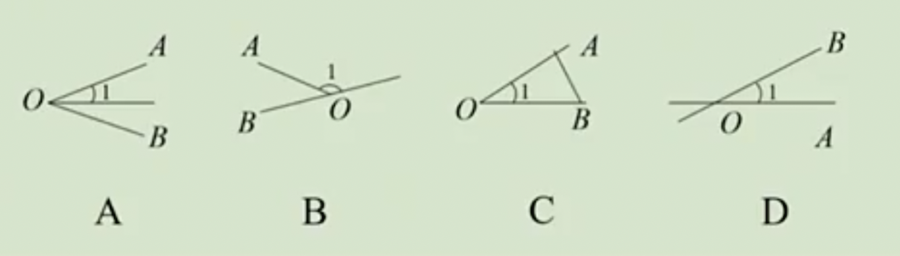
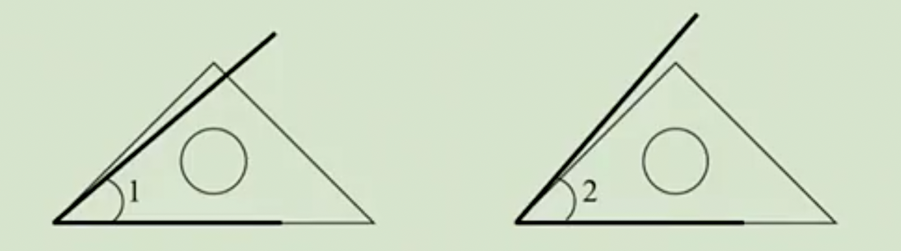

# 6.3.1 角练习题

### 角的概念

例1：下列说法正确的是（   ）
A：角是由两条射线组成的图形
B：角的大小与所画角的两边的长短无关，只与两条边张开的角度有关
C：角的两边是射线，射线是无限延伸的，所以角是不可以度量的
D：把一个角用放大镜来观看，角的度数也会相应地扩大

答案：B

例2：两个锐角的和不可能是（   ）
A：锐角    B：直角    C：钝角    D：平角

答案：D

例3：下列说法中正确的是（   ）
A：大于直角的角都是钝角
B：小于平角的角都是锐角
C：平角是最大的角
D：钝角总比锐角大

答案：D

例4：下列选项中，能用∠AOB，∠O，∠1表示同一个角的是（   ）

答案：C

### 角的比较与运算

例5：如图，用同一个三角板比较∠1与∠2的大小，下列说法正确的是（   ）
A：∠1<∠2    B：∠1=∠2    C：∠1>∠2    D：不能确定

答案：A

例6：已知∠1=15.23°，∠2=15°23′，比较这两个角的大小。

答案：∠1<∠2

例7：计算：
（1）25°16'37"+48°45'28"；
（2）180°-45º18′；
（3）35°35'×5;
（4）360°÷7（精确到分）。

例8：4时5分时，钟表的时针和分针的夹角是多少？

答案：92.5º