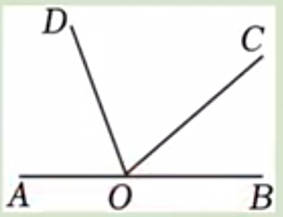

# 6.3.3 角平分线、余角和补角

### 角平分线

例1：如图，点O在直线AB上，OD是∠AOC的角平分线，∠COB=42°，求∠DOC的大小。

答案：69º

例2：如图，OE平分∠AOC，OD平分∠BOC，∠AOB=80°，∠1=15°，求∠2。

答案：25º

例3：如图，已知O为直线AB上一点，过点O向直线AB上方引三条射线OC,OD,OE，且OC平分∠AOD，∠2=3∠1，∠COE=70°，求∠2的度数。

答案：60º

例4：如图，回答下列问题：
（1）若∠AOB=∠COD，判断∠AOC与∠BOD是否相等，并说明理由；
（2）若OB平分∠AOC，OC平分∠BOD，判断∠AOB与∠COD是否相等，并说明理由。

答案：（1）相等；（2）相等。

例5：如图，∠AOC=∠BOD=90°，且∠AOD=3∠BOC，求∠AOB的度数。

答案：45º

例6：如图，∠AOC=∠BOD=100°，当∠BOC变小时，∠AOD会如何变化？

答案：变大

例7：如图，∠AOB=150°，∠AOC=90°，OD平分∠BOC，射线OE从OA出发，绕点O以每秒5°的速度顺时针旋转，当OE转到与OB重合时停止旋转。问在整个旋转过程中，当旋转时间为几秒时，∠COE与∠COD的度数之比是2:1？

答案：5秒或30秒

### 余角和补角

例8：如果一个角的度数比它余角的度数的两倍还多10°，求这个角的度数。

答案：$\frac{190^º}{3}^º$

例9：如图，点〇在直线AB上，OD,OE分别平分∠BOC和∠AOC。
（1）写出与∠COE互余的角；
（2）写出与∠COE互补的角。

答案：（1）∠COD与∠BOD；（2）∠EOB。