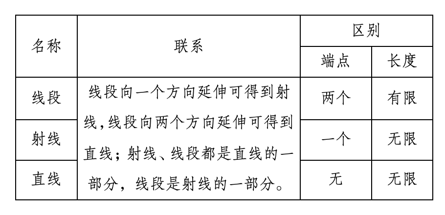

# 第六章 几何图形初步

## 6.1 几何图形

1. 点、线段、三角形、四边形、圆、长方体、圆柱、圆锥、球等，都是从形形色色的物体外形中得出的，它们都是几何图形。
1. 几何：形状、大小、位置关系。

### 6.1.1 立体图形与平面图形

1. 有些几何图形(如长方体、正方体、圆柱、圆锥、球等）的各部分不都在同一平面内，它们是**立体图形**。棱柱、棱锥也是常见的立体图形。
2. 有些几何图形(如线段、角、三角形、长方形、圆等)的各部分都在同一平面内，它们是**平面图形**。
3. 对于一些立体图形的问题，常把它们转化为平面图形来研究。从不同方向看立体图形，往往会得到不同形状的平面图形。
4. 有些立体图形是由一些平面图形围成的，将它们的表面适当展开，可以展开成平面图形。这样的平面图形称为相应立体图形的展开图。

### 6.1.2 点、线、面、体

1. 长方体、正方体、圆柱、圆锥、球、棱柱、棱锥等都是几何体。几何体也简称体。
2. 包围着体的是面。面有平的面和曲的面两种。
3. 点动成线，线动成面，面动成体。

## 6.2 直线、射线、线段

### 6.2.1 直线、射线、线段

1. 经过一个点能画无数条直线。

2. 经过两点有一条直线，并且只有一条直线。

   简单说成：**两点确定一条直线。**

3. 因为两点确定一条直线，所以除了用一个小写字母表示直线(如直线$l$)，我们还经常用一条直线上的两个点来表示这条直线(如直线$AB$)。表示直线的方法：

   1. 用一个小写的英文字母表示，如直线$l$；
   2. 用直线上的两点表示，如直线AB（或直线BA）。

4. 一个点在一条直线上，也可以说这条直线经过这个点；一个点在一条直线外，也可以说这条直线不经过这个点。

5. 当两条不同的直线有一个公共点时，就称这两条直线相交，这个公共点叫作它们的**交点**。

6. 射线和线段都是直线的一部分。类似于直线的表示线段$AB$(或线段$BA$)，其中点$A$、点$B$是线段的端点。表示射线$OA$，其中点$O$是射线的端点。

7. 连接$AB$，就是要画出以$A$，$B$为端点的线段；延长线段$AB$，是指按从端点$A$到$B$的方向延长；延长线段$BA$，是指按从端点$B$到$A$的方向延长，这时也可以说反向延长线段$AB$。

8. 直线、射线、线段之间的联系与区别：

   

### 6.2.2 线段的比较与运算

1. 不同于直线和射线，线段有长度，因而可以比较线段的长短。
2. 画一条线段等于已知线段$AB$，可以先用刻度尺量出线段$AB$的长度，再画一条等于这个长度的线段。也可以先用直尺画直线$l$，再用圆规在直线$l$上截取$CD=AB$。
3. 限定用无刻度的直尺和圆规作图，这就是**尺规作图**。
4. 比较两条线段的长短，可用刻度尺分别测量出它们的长度来比较，或者把其中的一条线段移到另一条线段上作比较。
5. 两点的所有连线中，线段最短。简单说成：两点之间，线段最短。
6. 连接两点的线段的长度，叫作这两点间的距离。
7. 点$M$把线段$AB$分成相等的两条线段$AM$与$MB$，点$M$叫作线段$AB$的中点。类似地，还有线段的三等分点、四等分点等。

## 6.3 角

### 6.3.1 角的概念

1. 有公共端点的两条射线组成的图形叫作**角**（静态定义），这个公共端点是角的**顶点**，这两条射线是**角的两条边**。

2. 角也可以看作由一条射线绕着它的端点旋转而形成的图形（动态定义）。初始位置的边始边，终止位置的边终边。

3. 周角和平角

   当终边和始边成一条直线时，形成**平角**；当终边和始边重合时，形成**周角**。

4. 角的表示方法：

   1. 用三个大写英文字母表示，记作∠AOB或∠BOA，表示顶点的字母O写在中间。
      当在顶点处只有一个角时，也可以用一个大写英文字母表示，记作：∠O。
   2. 用一个小写希腊字母表示，记作∠α。
      根据作图的需要，角的开口可以朝向任意方向。
   3. 用一个数字表示，记作∠1。

5. 我们常用量角器量角，度、分、秒是常用的角的度量单位。把一个周角360等分，每一份就是1度的角，记作1°；把1度的角60等分，每一份叫作1分的角，记作1′；把1分的角60等分，每一份叫作1秒的角，记作1″。

6. 以度、分、秒为单位的角的度量制，叫作**角度制**。

### 6.3.2 角的比较与运算

1. 与线段长短的比较类似，可以用量角器量出角的度数，然后比较它们的大小；也可以把它们的一条边叠合在一起，通过观察另一条边的位置来比较两个角的大小。
2. 从一个角的顶点出发，把这个角分成两个相等的角的射线，叫作这个角的平分线。类似地，还有角的三等分线等。

### 6.3.3 余角和补角

1. **角平分线**：从一个角的顶点出发，把这个角分成两个相等的角的射线。
   注意：角平分线是一条射线。

2. 如果两个角的和等于90°(直角)，就说这两个角互为**余角**，简称这两个角互余，其中一个角是另一个角的余角.

3. 如果两个角的和等于180°(平角)，就说这两个角互为**补角**，简称这两个角互补，其中一个角是另一个角的补角.

4. 同角 （等角）的余角相等。

   同角 （等角）的补角相等。