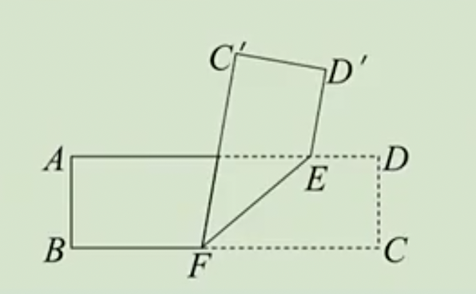

# 7.1.1 两直线相交练习题

## 7.1.1 两直线相交

例1：图中是对顶角的是（   ）

答案：B

例2：判断下列说法是否正确：

（1）两个对顶角总是有公共顶点；

（2）有公共顶点的角是对顶角；

（3）若一个角的两边所在的直线与另一个角的两边所在的直线重合，那么这两个角互为对顶角；

（4）相等的角是对顶角。

答案：（1）√；（2）×；（3）×；（4）×。

例3：如图，有一个六边形的古塔，小明要测量外墙底角$∠AOB$的度数，分别作AO,BO的延长线OC,OD，通过量出$∠COD$的度数来得到$∠AOB$的度数。请问这个测量的依据是什么？你是否还能否设计另一种测量方案？

答案：依据是对顶角相等。还可以测量出$∠AOD$的度数，并用$180º-∠AOD$得到$∠AOB$。

例4：如图，直线AB,CD交于点O，$∠AOC=70$°，$∠DOE =28°$，求$∠AOE$的度数。

答案：138º

例5：如图，根据条件求解：

（1）若$∠2=5∠3$，求$∠1$；

（2）若$∠1＋∠3=80°$求$∠2$。

答案：（1）$∠1=30º$；（2）$∠2=140º$。

例6：如图，直线AB,CD交于点O，OE,OF分别是$∠BOD$,$∠COE$的平分线，若$∠AOD =2∠AOC$，求$∠EOF$的度数。

答案：$∠EOF=75º$

例7：如图，将一个长方形纸片ABCD沿EF折叠，使得C,D两点落到$C'$，$D'$的位置，若$∠AED'-∠AEF=60°$，求$∠DEF$的度数。

答案：140º

## 7.1.2 两直线垂直

例8：直线AB,CD交于点O，判断下列条件是否能说明$AB⊥CD$：

（1）∠AOC=90°；

（2）∠COB=∠AOD；

（3）∠BOC=∠BOD；

（4）∠AOC+∠BOC=180°；

（5）∠AOD+∠BOD=180°。

（1）√；（2）×；（3）√；（4）×；（5）×。

例9：关于垂线的性质，判断下列说法是否正确：

（1）对任意一条直线而言，仅有一条直线与它垂直；

（2）过已知直线上一点，有且仅有一条直线与它垂直；

（3）过已知直线外任意一点，都可以作出与已知直线垂直的直线。

答案：（1）×；（2）×；（3）√。