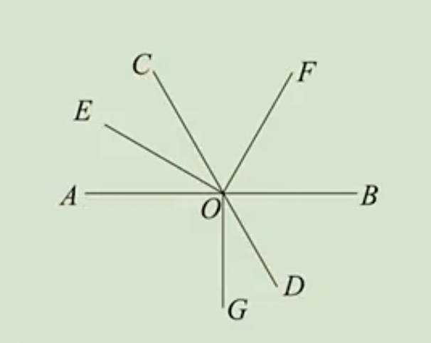
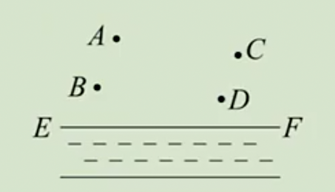
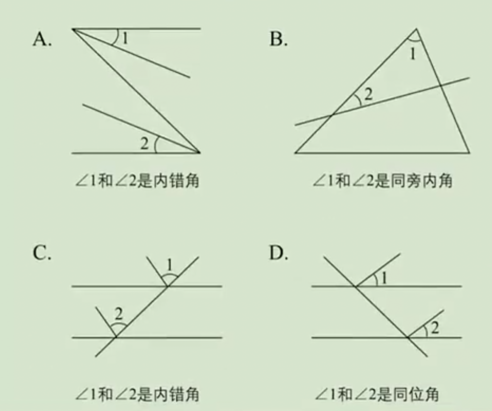
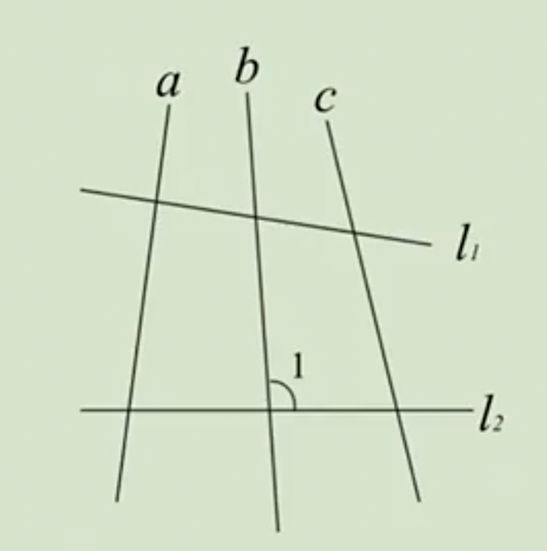
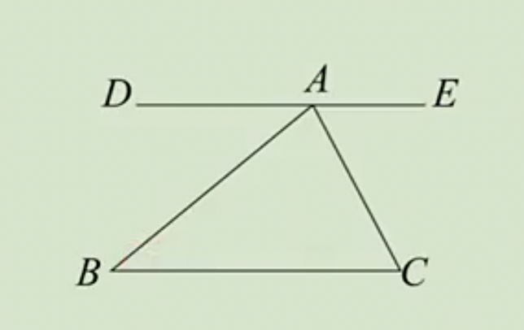

# 7.1.2 两直线垂直练习题

## 1.垂直相关的计算

例1：直线AB,CD交于点O，OE⊥CD，垂足为O，若$∠AOD=3∠BOD$，求$∠AOE$的度数。

答案：45º或135º

例2：如图，直线AB,CD交于点O，OE,OF分别是$∠AOC$,$∠BOC$的平分线，OG⊥AB于点O。

（1）求$∠EOF$的大小；

（2）设$∠EOG=∠BOF+62°$，求$∠DOG$的度数。

答案：（1）90º；（2）280º

## 2.垂线段

例3：直角三角形ABC中，AD是斜边BC上的高，下列关系中一定正确的是（   ）

A: AC<CD

B: AB>BD

C: AD<BD

D: AB>AC

答案：B

例4：已知A，B是直线$l$上两点，P在直线$l$外，若PA=5，PB=6，则在4.5、5、5.5、6、6.5这5个数中，可能是点P到直线$l$的距离的为__。（写出所有满足题意的数）

答案：4.5和5

例5：如图，平原上有A,B,C,D四个村庄，为解决当地缺水问题，政府准备投资修建一个蓄水池

（1）不考虑其他因素，请你画图确定蓄水池H点的位置，使它到四个村庄距离之和最小；

（2）计划把河水引入蓄水池H中，怎样开渠最短？请说明理由。

答案：（1）当H为AD与BC交点时，它到四个村庄距离之和最小。

（2）过H做HG⊥EF于G，沿HG开渠最短。

例6：如图，下列说法正确的是（   ）

答案：B

例7：如图，图中与$∠1$成同位角的角有（   ）

A:1个    B:2个    C:3个    D:4个

答案：C

例8：如图：

（1）$∠B$与哪个角是内错角？

（2）$∠B$与哪个角是同旁内角？

（3）$∠C$与哪个角是内错角？

（4）$∠C$与哪个角是同旁内角？

（1）$∠DAB$；（2）$∠BAC$，∠BAE，$∠C$；（3）$∠EAC$；（4）$∠DAC$，$∠BAC$，$∠B$。
