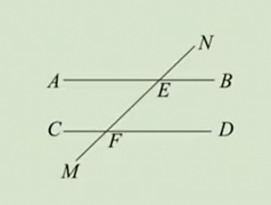
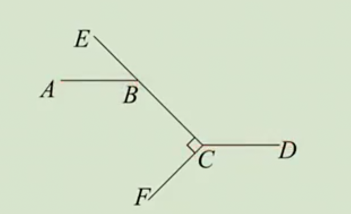
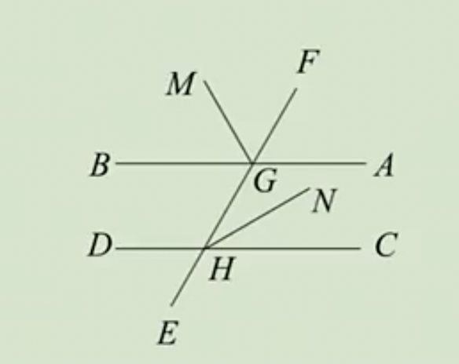
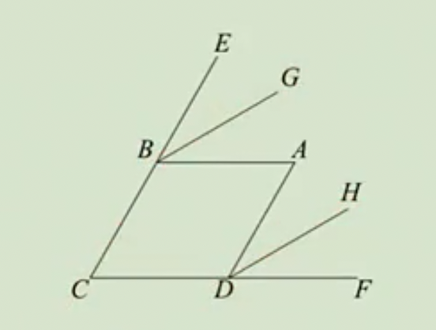

# 7.2 平行线练习题

## 1.平行线

例1：关于平行线，判断下列说法是否正确：

（1）不相交的两条直线是平行线；

（2）同一平面内，如果两条不同的直线不相交，它们一定平行；

（3）同一平面内，如果两条不同的线段不相交，那么这两条线段平行。

答案：（1）×；（2）√；（3）×。

例2：关于平行线，判断下列说法是否正确：

（1）过直线外一点，有且仅有一条直线与已知直线平行；

（2）过直线上一点，有且仅有一条直线与已知直线平行；

（3）已知a,b,c,d是平面内四条直线，如果$a∥b$，$b∥c$，$c∥d$， 那么$a∥d$。

答案：（1）√；（2）×；（3）√。

例3：如图，梯形ABCD中，AB∥CD，过线段BC上一点P（与B,C不重合），作PQ∥AB交AD于点Q，则PQ∥CD，理由是__。

答案：平行于一条直线的两条直线平行。

## 2.平行线的判定

例4：如图，直线MN分别与直线AB,CD交于点E和点F，下列选项中不能证明AB∥CD的是（   ）

A. $∠NEB+∠NFC=180°$

B. $∠NEB=∠NFD$

C. $∠AEM=∠NFD$

D. $∠NEB=∠NFC$

答案：D

例5：如图，已知CF⊥CE，∠DCF-∠ABE=90°，请说明AB∥CD。

例6：如图，直线EF分别交AB,CD于点G,H，GM, HN分别平分$∠BGF$与$∠CHG$，已知$∠MGB+∠CHN=90°$，请说明AB∥CD。

例7：如图，四边形ABCD中，分别延长CB,CD至点E,F，BG,DH分别是$∠ABE$,$∠ADF$的角平分线。己知$∠ABE$＝$∠BAD$＝$∠ADF$，清说明BG∥DH。

答案：作$∠BAD$的角平分线