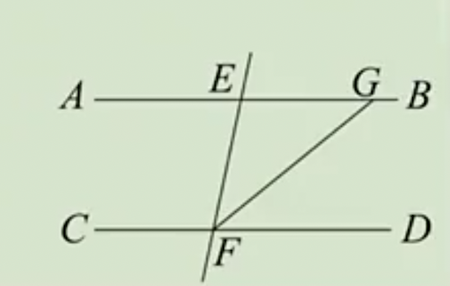
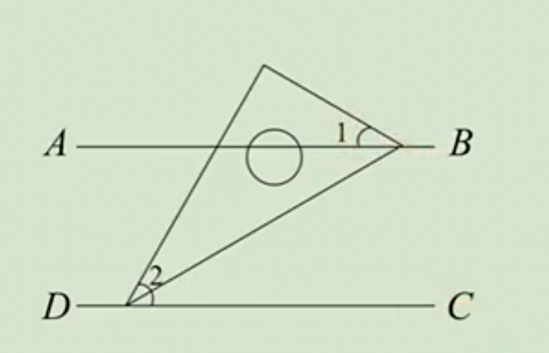
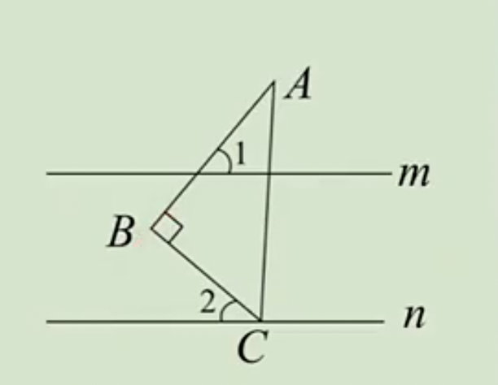

# 7.2.3 平行线的性质练习题

例1：如图，平行线AB,CD被直线EF所截，FG平分$∠EFD$，若$∠EFD=78°$，求$∠EGF$的度数。

例2：如图，AB∥CD，一块含有30°角的直角三角板按如图所示位置摆放，已知$∠1=30°$，求$∠2$的度数。

答案：60º

例3：如图，直线m∥n，△ABC是直角三角形，$∠B=90°$，点C在直线n上。若$∠1=50°$，求$∠2$的度数。

答案：40º