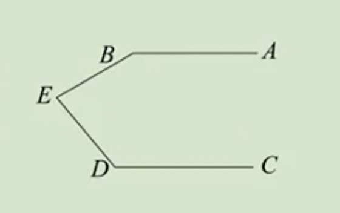
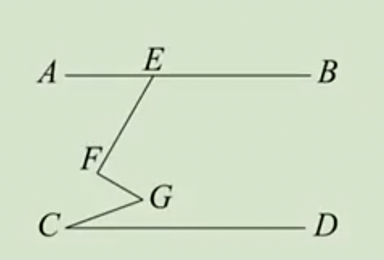
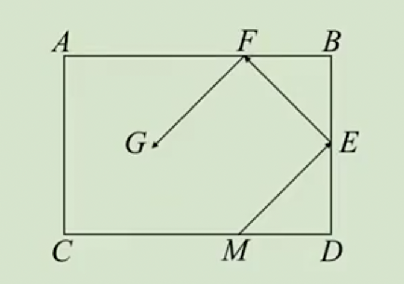
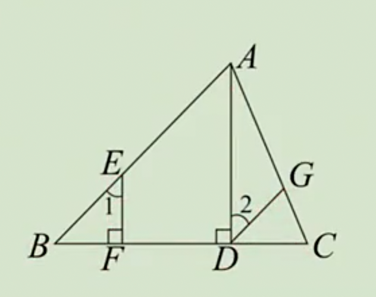

# 平行线综合练习题

例1：如图，AB∥CD，$∠B=150°$，$∠BED=80°$，求$∠D$的度数。

答案：$∠D=30º$

例2：如图，$AB∥CD$，E在直线$AB$上，且$EF⊥FG$，$∠AEF=60°$，$∠C=20°$，求$∠FGC$的度数。

答案：$∠FGC=50º$

例3：如图是一个台球桌，图中箭头表示了一个台球从M点出发经两次反弹后的行进路线。在球碰壁的反弹过程中，我们始终有$∠BEF= ∠DEM$，$∠AFG=∠BFE$。

（1）若$∠DME=45°$，试说明$ME∥FG$；

（2）若$∠DME=α$，$α$是一个锐角，是否还有$ME∥FG$成立？

例4：如图$AD⊥BC$，$EF⊥BC$，$∠1=∠2$，求证：$∠DGC=∠BAC$。

