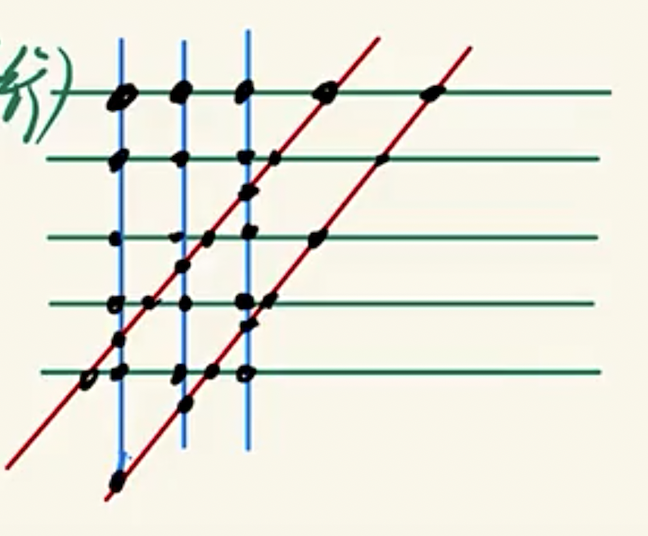
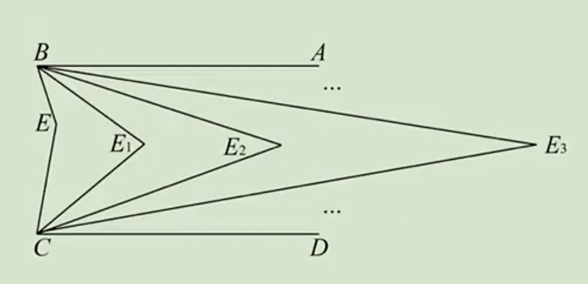
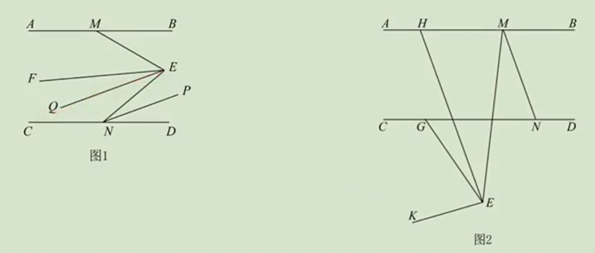
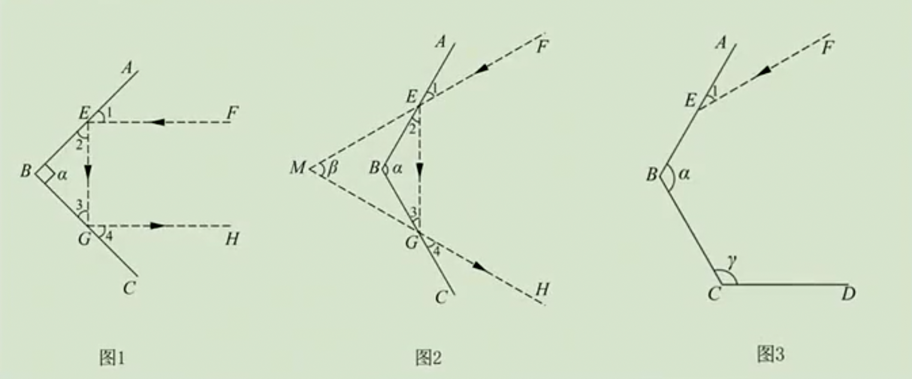

# 扩展篇-平行线练习题

例1：平面上有5条直线，其中任意两条都不平行，求证：在这五条直线两两相交所成的角中，至少有一个角不超过36°。

答案：解：取平面上任意一点P（P不在这5条直线上）
过P做这5条直线平行线
如图，形成10个角，这10个角都是某两天直线相交所成的角
$∠1+∠2+...+∠10=360º$
$∴$至少有一个角不超过36º

例2：在同一平面内，请作出10条直线，使得这10条直线共有31个交点，且没有任何三条直线交于一点。

答案：解：若10条直线两两相交，有10×9÷2=45个交点
让其中5条直线互相平行，还有45-5×4÷2=35个交点
再让3条直线互相平行（与前5条不平行），还有35-3×2÷2=32个交点
再让2条直线互相平行（与前8条不平行）

例3：平面上n条直线中，每条恰与另外的37条相交，求n的值。

答案：解：根据平行关系，设有共有K类直线，分别有$a_1，a_2...a_k$条，其中每类中的直线互相平行，不同类的直线两两相交
由题意：$a_1+a_2+...+a_k=n$  ①
$n-a_1=n-a_2=...=n-a_k=37$
则$a_1=a_2=...=a_k=n-37$
设$a_1=a_2=...=a_k=a$，$a=n-37$​
代入①$\begin{cases}
k·a=n \\
a=n-37
\end{cases} $  $a=ka-37$
(k-1)a=37

$\begin{cases}k-1=1 \\a=37\end{cases}$    或    $\begin{cases}k-1=37 \\a=1\end{cases}$

即$\begin{cases}k=2\\a=37\end{cases}$    或    $\begin{cases}k=38\\a=1\end{cases}$

$∴n=74$或38

例4：如图，已知$AB∥CD$，$CE$,$BE$交于点$E$，作$∠ABE$和$∠DCE$的平分线，交于点$E_1$；再作$∠ABE_1$和$∠DCE_1$的平分线，交于点$E_2$；再作$∠ABE_2$和$∠DCE_2$的平分线，交于点$E_3$；…持续这个操作，直到作$∠ABE_{n-1}$和$∠DCE_{n-1}$的平分线，交于点$E_n$。已知$∠E_n=aº$，求∠$BEC$的度数。

答案：$∠BEC=2^n∠BE_nC$

例5：已知$AB∥CD$，点M,N分别在直线$AB$,$CD$上，$E$为平面内一点。

（1）如图1，设$∠BME=mº$，$EF$,$NP$分别是$∠MEN$,$∠END$的平分线，$EQ∥NP$，求$∠FEQ$的度数（用含m的式子表示）；

（2）如图2，$G$为$CD$上一点，$∠BMN=n·∠EMN$，$∠GEK=n·∠GEM$，直线$EH∥MN$交$AB$于点$H$，求证：$n∠GEH=∠GEK-∠BMN$。

答案：（1）∠FEQ=\frac12mº

例6：光线经过镜面反射时，入射光线、反射光线与镜面所夹的角对应相等。比如图1和图2中，都有$∠1=∠2$，$∠3=∠4$。

（1）图1中，AB与BC是两面镜子，EF与GH分别是入射光线和反射光线，求证：当且仅当$AB⊥BC$时，有$EF∥GH$；

（2）图2中，AB与BC是两面镜子，$∠ABC=α$，$90°<α<180°$，EF与GH分别是入射光线和反射光线，它们的夹角$∠FMH=β$，求$α$和$β$的数量关系；

（3）图3中，AB,BC,CD是三面镜子，$α=120°$，若入射光线EF与镜面AB的夹角$∠1=mº$（0°<m <90°），且入射光线经过n次反射后的反射光线与$EF$平行，分别求$n=2$和$n=3$时$γ$的大小（可用含m的式子表示）。

答案：（2）$β=2α-180º$；（3）$n=2$时，γ=150º；$n=3$时，$γ=90º+mº$。
