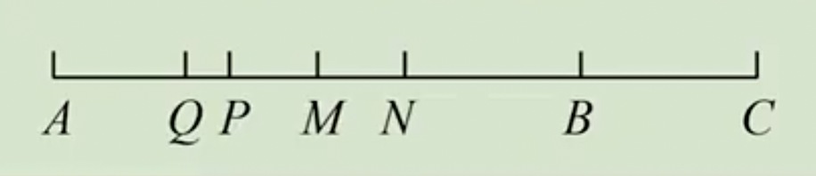
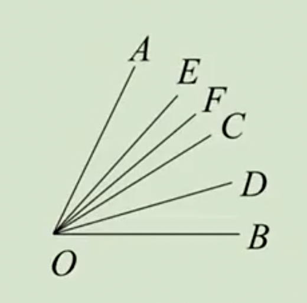
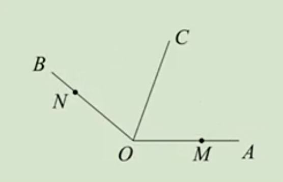
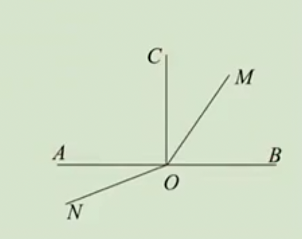

# 扩展篇-线与角练习题

例1：如图，已知点M,N,P,Q分别为线段AB,AC,NA,MA的中点，求MN:PQ的值。

答案：MN:PQ=2:1

例2：如图，射线OC,OD,OE,OF分别平分$∠AOB, ∠COB,∠AOC,∠EOC$，若$∠FOD=24°$，求$∠AOB$的度数。

答案：∠AOB=64º

例3：A,B,C,D四点在数轴上对应的点分别是5,9,-6,-8。

（1）若线段CD以每秒3个单位的速度向右匀速运动，从线段CD与线段AB有重叠部分开始，经过几秒之后，这两条线段不再有重叠部分？

（2）若线段AB,CD同时开始移动，线段AB以每秒2个单位的速度向左匀速运动，线段在CD以每秒3个单位的速度向右匀速运动，点P，Q分别是线段CD，AB的中点，运动几秒时，点P与点Q的距离是一个单位？

答案：（1）2秒；（2）3或$\frac{13}{5}$。

例4：A,B,C,D四点在数轴上对应的点分别是a,b,c,d，且a,b是方程|x+7|=1的两个解，其中a<b，$(c-12)^2$与|d-16|互相反数，若线段AB以3个单位/秒的速度向右匀速运动，线段CD以1个单位/秒的速度向左匀速运动，已知运动t秒后，A，B两点都在线段CD上且不与线段CD端点重合，且有BD=2AC，求t的值。

答案：$t=\frac{31}{6}$

例5：如图，$∠AOB=140°$，M, N分别是OA,OB上的点，线段OM，ON同时开始旋转，OM以30度/秒的速度绕点O逆时针旋转，ON以10度/秒的速度绕点O顺时针旋转，当OM旋转到与OB重合时，两条线段都停止旋转。

（1）旋转2秒和4秒时，$∠MON$的度数分别是多少？

（2）若OC是$∠AOB$的平分线，旋转几秒时，$∠NOB$和$∠COM$中的一个角是另一个角的两倍？

答案：（1）2秒时，∠MON=60º，4秒时，∠MON=20º；（2）t=2或$\frac75$或$\frac{14}{5}$

例6：如图，点〇为直线AB上一点，$∠AOC=∠BOC=90°$，射线OM从OC出发绕点O以每分钟18°的速度顺时针旋转一周，同时射线ON从OA出发绕点O逆时针方向以每分钟12°的速度旋转，当OM停止旋转时，ON也随之停止。（本题所有角均指小于180°的角）

（1）旋转2分钟时，求$∠MON$；

（2）当$∠AON=2∠BOM-30°$时，旋转了几分钟？

解：（1）$∠MON=150º$；（2）$\frac{25}{8}$或$\frac{35}{4}$

例7：在一条直线上作n个不同的点，这些点为端点的线段共有多少条？

答案：$\frac{n(n-1)}{2}$

例8：同一平面内有n条不同的直线，它们两两相交，最少有几个交点？最多有几个交点？

答案：最少1个，最多$\frac{n(n-1)}{2}$个。

例9：同一平面内n条不同的直线最多把平面分成几个部分？

答案：$\frac{n^2+n+2}{2}$