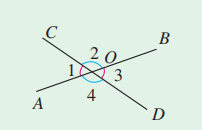
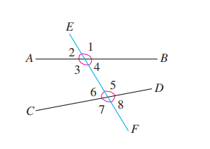
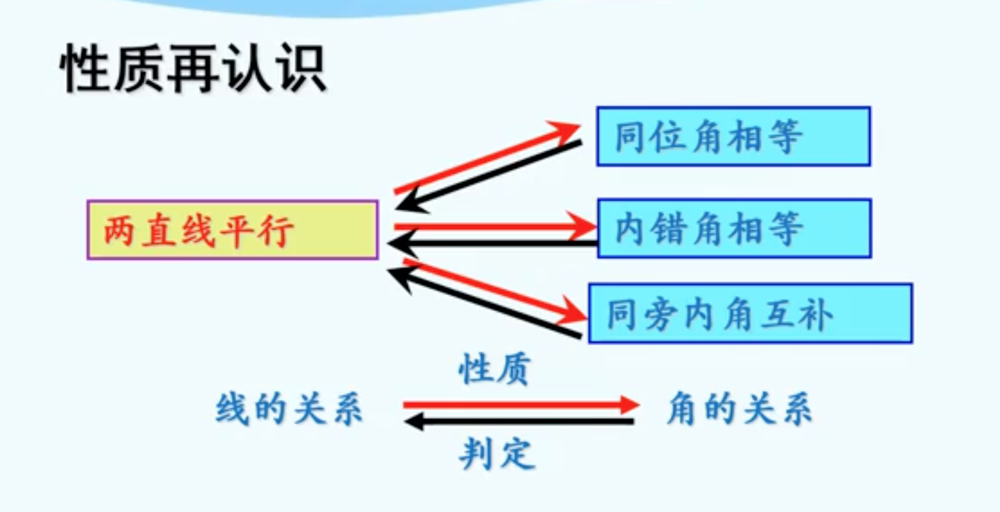

# 第七章 相交线与平行线

## 7.1 相交线 

### 7.1.1 两直线相交

1. 如果两个角有一条公共边，它们的另一边互为**反向延长线**(∠1和∠2互补)，具有这种关系的两个角，互为**邻补角**。
1. 如果两个角有一个公共顶点，并且一个角的两边分别是另一个角的两边的**反向延长线**，具有这种位置关系的两个角，互为**对顶角**。
1. **同角的补角相等**。
1. 邻补角、对顶角的性质： **邻补角互补，对顶角相等**。
1. 因为∠1与∠2互补，∠3与∠2互补(邻补角的定义)，所以∠1=∠3(同角的补角相等)。

### 7.1.2 两直线垂直

1. 当两条直线a，b相交所成的四个角中，有一个角是直角时，我们说a与b互相**垂直**，记作“$a⊥b$”。
2. 垂直是相交的一种特殊情形。两条直线互相垂直，其中的一条直线叫做另一条直线的**垂线**，它们的交点叫做**垂足**。
3. 一条直线的垂线有无数条。
4. 垂线的性质：
   1. 经过一点(已知直线上或直线外)，能画出已知直线的一条垂线，并且只能画出一条垂线。
      即**在同一平面内，过一点有且只有一条直线与已知直线垂直**。
   2. 连接直线外一点与直线上各点的所有线段中，**垂线（存在且唯一）段最短**。 
      简单说成：**垂线段最短**。 
      直线外一点到这条直线的垂线段的长度，叫做**点到直线的距离**。
5. 点到直线的距离，本质上是点到直线上所有点的距离的最小值。

### 7.1.3 两条直线被第三条直线所截

1. 如图，直线AB，CD与EF相交(也可以说两条直线AB，CD被第三条直线EF所截)，构成八个角。我们看那些没有公共顶点的两个角的关系。
   1. 先看图中的∠1和∠5，这两个角分别在直线AB，CD的同一方(上方)，并且都在直线EF的同侧(右侧)，具有这种位置关系的一对角叫做**同位角**。
   2. 再看∠3和∠5，这两个角都在直线AB，CD之间，并且分别在直线EF两侧(∠3在直线EF左侧，∠5在直线EF右侧)，具有这种位置关系的一对角叫做**内错角**。
   3. 图中∠3和∠6也都在直线AB，CD之间，但它们在直线EF的同一旁(左侧)，具有这种位置关系的一对角叫做**同旁内角**。

## 7.2 平行线

### 7.2.1 平行线的概念

1. 在同一平面内，当直线a，b不相交时，我们说直线a与b互相**平行**，记作 “a∥b”。

   注意：1.在**同一平面内**是前提条件；2. 平行线指的是**两条直线**。

2. 在同一平面内，不重合的两条直线只有两种位置关系：**相交**（一个交点）和**平行**（没有交点）。

3. 平行公理：**过直线外一点，有且只有一条直线与这条直线平行**。

4. 平行公理推论：**如果两条直线都与第三条直线平行，那么这两条直线也互相平行**。也就是说：如果b∥a，c∥a，那么b∥c。

### 7.2.2 平行线的判定

1. 判定方法1：两条直线被第三条直线所截，如果同位角相等，那么这两条直线平行。
   简单说成：**同位角相等，两直线平行**。

2. 判定方法2：两条直线被第三条直线所截，如果内错角相等，那么这两条直线平行。

   简单说成：**内错角相等，两直线平行**。

3. 判定方法3：两条直线被第三条直线所截，如果同旁内角互补，那么这两条直线平行。
   简单说成：**同旁内角互补，两直线平行**。

4. 判定两条直线平行的方法有哪些？

   1. 平行线的定义；
   2. 平行公理的推论；
   3. 判定方法1：同位角相等，两直线平行；
   4. 判定方法2：内错角相等，两直线平行；
   5. 判定方法3：同旁内角互补，两直线平行。

### 7.2.3 平行线的性质

1. 性质1：两条平行线被第三条直线所截，同位角相等。

   简单说成：**两直线平行，同位角相等**。

2. 性质2：两条平行线被第三条直线所截，内错角相等。

   简单说成：**两直线平行，内错角相等**。

3. 性质3：两条平行线被第三条直线所截，同旁内角互补。

   简单说成：**两直线平行，同旁内角互补**。

4. 判定和性质之间的关系

   

## 7.3 定义、命题、定理

1. 我们在学习一些新的数学对象时，对它们进行了清晰、明确的描述。这样的描述称为数学对象的**定义**。
2. 可以判断为正确（或真）或错误（或假）的陈述语句，叫作**命题**。被判断为正确（或真）的命题叫作**真命题**，被判断为错误（或假）的命题叫作**假命题**。
3. 数学中的命题常可以写成 “如果……那么……”的形式，这时 “如果”后接的部分是题设，“那么”后接的部分是结论。
4. 如果题设成立，那么结论一定成立，这样的命题叫做**真命题**。题设成立时，不能保证结论一定成立，这样的命题叫做**假命题**。
5. 有些命题的正确性是经过推理证实的，这样得到的真命题叫做**定理**。定理也可以作为继续推理的依据。
6. 在很多情况下，一个命题的正确性需要经过推理才能作出判断，这个推理过程叫做**证明**。
7. 判断一个命题是假命题，只要举出一个例子(反例)，它符合命题的题设，但不满足结论就可以了。

## 7.4 平移 

1. 在平面内，将一个图形按某一方向移动一定的距离，这样的图形运动叫作**平移**。图形平移的方向不限于水平或竖直方向，图形可以沿平面内任何方向平移。
2. 把一个图形平移，得到的新图形具有下列特点：
   1. 新图形与原图形的形状和大小完全相同。
   2. 新图形中的每一点，都是由原图形中的某一点移动后得到的，这两个点是对应点。连接各组对应点的线段平行（或在同一条直线上）且相等。
3. 几何图形都可以看作由点组成，对于一些规则的几何图形，只要画出图形中的一些关键点经过平移后的对应点，连接这些对应点，就可以得到原图形平移后的图形。