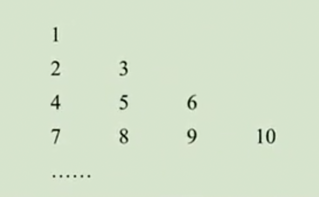

# 9.1 用坐标描述平面内点的位置练习题

## 1.有序数对

例1：甲、乙、丙住在同一个小区，甲住3号502室，我们记作（3,502）。

（1）如果乙住5号201室，可记作__。

（2）如果丙的住址我们用同样的方法可记为（70,102），则丙住在\_\_号\_\_室。

**答案：**（1）（5,201）；（2）70,102。

例2：如图，在某公园，以中心广场为观测点，用有序数对（200，45º）表示图中“荷花池”的位置，有序数对（250,330º）表示图中“登高楼”位置，则与图中“儿童天地”位置对应的有序数对为__。

**答案：**(150,165º)

例3：如图，学校在A（1,1）处，小明家在B（9,5）处，小明昨天回家走的路线是：（1,1）→（9,1）→（9,5），今天回家走的路线是：（1,1）→（5,1）→（5,5）→（9,5），请问哪条路线更长？

**答案：**一样长。

例4：我们把所有的正整数按下图排列，用有序数对（m,n）表示从上到下第m行第n列的数。

（1）有序数对（7,1）表示的数是多少？

（2）数58对应的有序数对的表示是多少？

**答案：**（1）22；（2）（11,3）。

## 2.平面直角坐标系

例5：下列选项中，平面直角坐标系的画法正确的是（   ）

答案：B

例6：在平面直角坐标系中，描出下列各点，并指出这些点是否在某个象限中。

（1）（5,-4）；（2）（-3,0）；（3）（-4.5,3.5）。

例7：已知点P（2-a,3a +6），根据条件，求点P的坐标。

（1）点P到两坐标轴的距离相等；

（2）点P在二、四象限的角平分线上；

（3）点Q（4,1），直线PQ∥y轴。

**答案：**（1）（3,3）或（6,-6）；（2）？；（3）（4,0）。