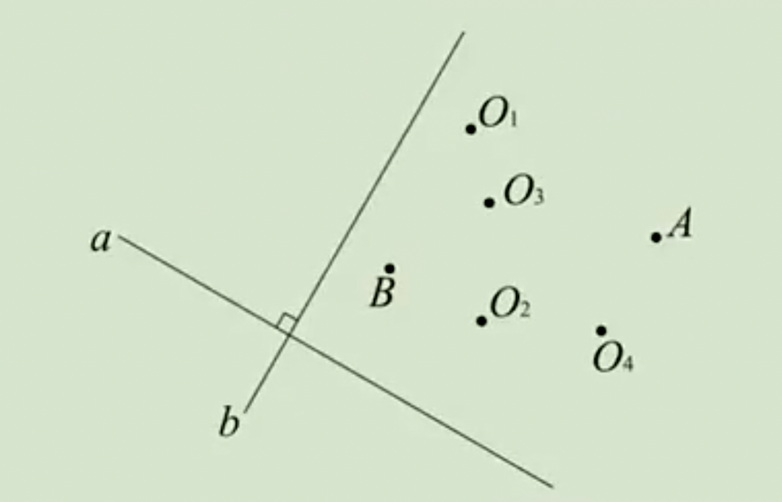
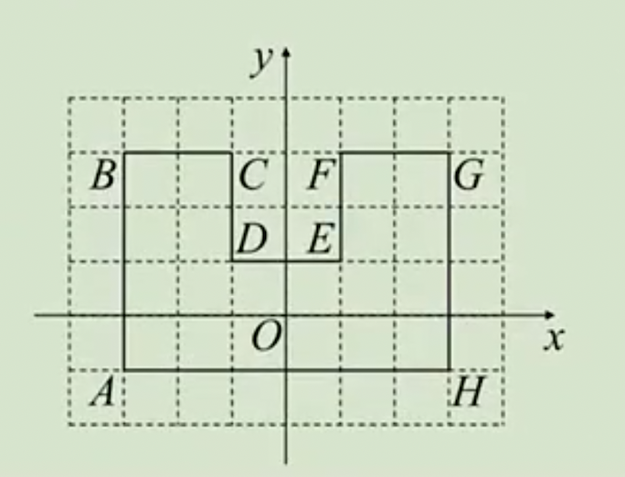
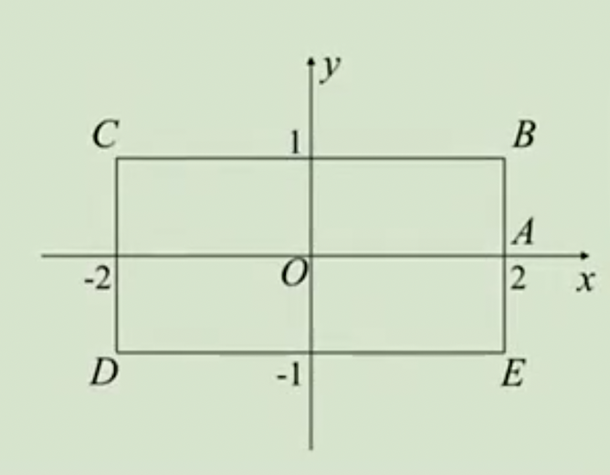

# 9.2 坐标方法的简单应用1练习题

## 1.面积问题

例1：设点A（$a，a^2-1$）在x轴负半轴，B（|b|-10,b-6）在y轴负半轴，O为坐标原点，求△AOB面积。

**答案：**8。

例2：根据条件，求△ABC面积：

（1）A（-1,5），B（0,1），C（3,1）；

（2）A（-1,5），B（1,-1），C（3,-1）；

（3）A（0,1），B（2,0），C（3,0）。

**答案：**（1）6；（2）6；（3）$\frac 72$。

例3：已知A（-3，-1），B（5，-1），C（2，4）。

（1）在线段AB作点D，使CD平分三角形ABC的面积，求点D的坐标；

（2）在y轴上作点Q，使三角形ABQ的面积是三角形ABC面积的$\frac 35$，求点Q的坐标。

**答案：**（1）（1，-1）；（2）（0，2）或（0，-4）。

## 2.位置的坐标表示

例4：有甲、乙、丙、丁四个地点，已知从甲地出发向东走100米即可到达乙地，从乙地出发向北走100米再向西走100米即可到达丙地，从乙地出发向南走100米再向东走100米即可到达丁地。请作出四个地点的位置示意图，建立合适的平面直角坐标系，并求四个地点的坐标。

例5：如图，直线a⊥b，在某平面直角坐标系中，x轴∥直线a，y轴∥直线b。点A的坐标为（3，1），点B的坐标为（-1，2），则坐标原点可能是（   ）

A:$O_1$    B:$O_2$    C:$O_3$    D:$O_4$

**答案：**C

例6：如图，A（-3，-1），B（-3，3），C（-1，3），D（-1，1）。坐标系的单位长度为1厘米，有一个蚂蚁以毎分爬1厘米，从A出发，接A→B→C→D→E→F→G→A的顺序连续绕圈爬行，求蚂蚁爬到101分钟所在位置的坐标。

**答案：**（-2，3）

例7：如图，长方形BCDE的各边均平行于坐标轴，物体甲和物体乙由点A（2，0）同时出发，沿长方形BCDE的边做环绕运动。物体甲沿逆时针方向以每秒1个单位长度的速度匀速运动，物体乙沿顺时针方向以每秒2个单位长度的速度匀速运动，求两个物体运动后的第2023次相遇地点的坐标。

**答案：**（-1，1）