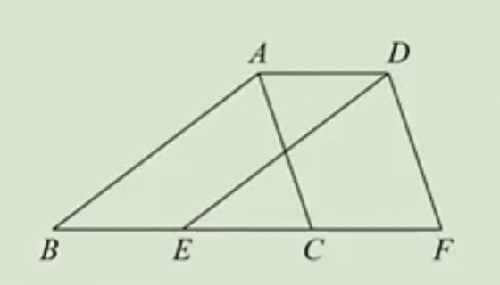
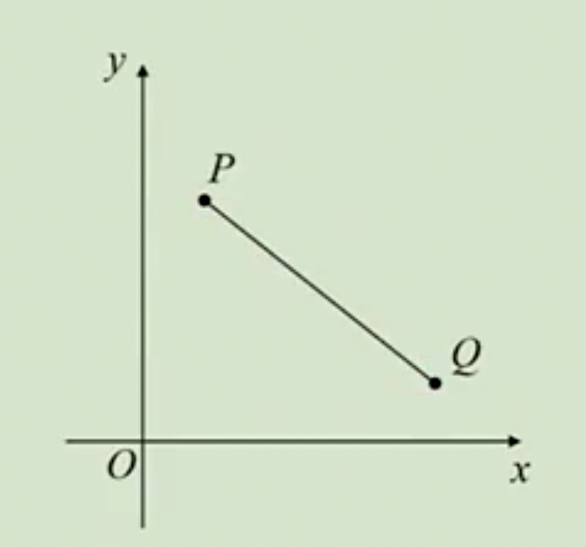
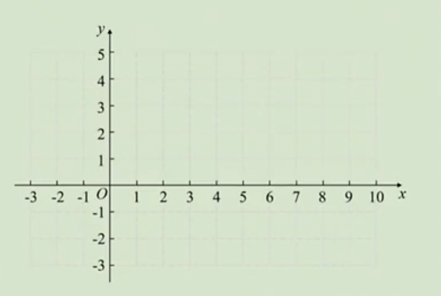

# 9.2 坐标方法的简单应用2练习题

## 1.平移

例1：如图，三角形ABC中，AB=6，AC=4，将三角形ABC向右平移得到三角形DEF，若四边形ABED和四边形ACFD的周长和32，求三角形ABC的平移距离。

**答案：**3

## 2.用坐标表示平移

例2：根据条件，求点的坐标：

（1）点A（4,3）向右平移3个单位后到点B，求点B的坐标；

（2）点A（4,3）向左平移2个单位，再向上平移1个单位后，到点B，求点B的坐标；

（3）点A向左平移4个单位后到点B（1,5），求点A的坐标。

**答案：**（1）（4，6）；（2）（2，4）；（3）（5，5）。

例3：将点（1，2）平移到点（-3，5），相应的平移变化可以是（   ）

A：先向左平移4个单位，再向下平移3个单位

B：先向右平移4个单位，再向下平移3个单位

C：先向上平移3个单位，再向右平移4个单位

D：先向上平移3个单位，再向左平移4个单位

**答案：**D

例4：如果三角形ABC经平移后得到三角形A'B'C'，点A（1，3）的对应点为A'（4，5），点B的对应点B'（1，7），求点B的坐标。

**答案：**（-2，5）

例5：若点P（x-6，4x+5）向左平移10个单位长度后对应的点在y轴上，求点P的坐标。

**答案：**（10，69）

例6：如图，第一象限内有两点P（m-4，n）、Q（m，n-3）。将线段PQ平移，使平移后的两段点分别落在两条坐标轴上，求平移后P点对应点的坐标。

**答案：**（0，3）或（-4，0）

例7：对于平面直角坐标系xOy中的图形G和图形G上的任意点P（x，y），给出如下定义：将点P（x，y）平移到P'（x+t，y-t）称为将点P进行“t型平移”，点P'称为将点P进行“t型平移”的对应点；将图形G上的所有点进行“t型平移”称为将图形G进行“t型平移”。已知，点A（1，1）和点B（3，1）。

（1）求将点A（1，1）进行“1型平移”后的对应点A'的坐标；

（2）若线段AB进行“t型平移”后与坐标轴有公共点，求t的取值范围。

**答案：**（1）A'（2，0）；（2）t=1或-3≤t≤1。