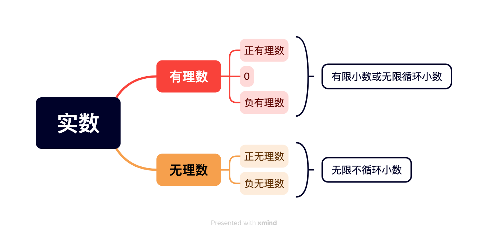
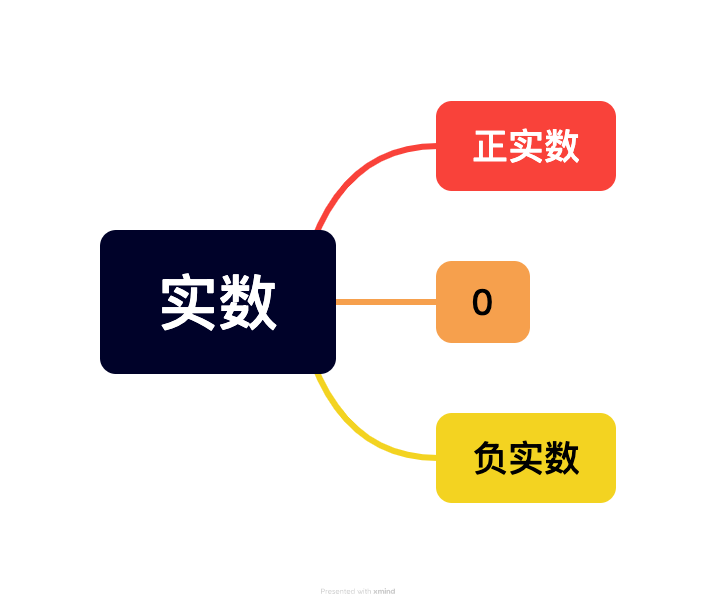

# 第八章 实数

## 8.1 平方根

1. 如果一个数x的平方等于a，即$x^2=a$，那么这个数x叫作a的**平方根**或**二次方根**。a为**被开方数**。
2. 求一个数的平方根的运算，叫作**开平方**。
3. 平方与开平方互为**逆运算**。
4. **正数有两个平方根，它们互为相反数**。算数平方根是其中正的平方根。
5. **0的平方根是0**。
6. **负数没有平方根**。
7. 正数a的正的平方根记为“$\sqrt{a}$”，读作“根号a”，a叫作**被开方数**；正数a的负的平方根可以用“$-\sqrt{a}$”表示，故正数a的平方根可以用“$±\sqrt{a}$”表示，读作“正、负根号a”。
8. 0的平方根记为$\sqrt０$。
9. 正数a有两个平方根，其中正的平方根$\sqrt{a}$叫作a的**算术平方根**。正数a的算术平方根用$\sqrt{a}$来表示。0的算术平方根为0。
10. **0的算术平方根是0**。0的算术平方根也记为$\sqrt{0}$。$\sqrt{0}=0$。
11. **被开方数越大，对应的算术平方根就越大**。
12. $\sqrt{a}$具有双重非负性：
    1. 被开方数a是非负数；
    2. 非负数a的算术平方根是非负数。

13. 对于任意a，都有$\sqrt{a^2}=|a|$。

## 8.2 立方根

1. 如果一个数x的立方等于a，即$x^3=a$，那么这个数x叫作a的**立方根**或**三次方根**。
2. 求一个数的立方根的运算，叫作**开立方**。
3. 开立方与立方也互为**逆运算**。
4. 任何一个数有且仅有一个立方根。不同的数立方根不同。（一个数和它的立方根是一一对应的。）
5. 正数的立方根是正数，负数的立方根是负数，0的立方根是0。
6. 一个数a的立方根记为“$\sqrt[3]{a}$”，读作“三次根号a”，其中a是**被开方数**，3是**根指数**。
7. $\sqrt[3]{a}$中的根指数“3”不能省略。
8. $\sqrt[3]{-a}=-\sqrt[3]{a}$。
9. 平方根等于（只有）它本身：0。立方根等于（只有）它本身：0，±1。

## 8.3 实数及其简单运算

1. 任何一个**有理数**都可以写成有限小数或无限循环小数的形式。反过来，任何有限小数或无限循环小数也都是**有理数**。

2. 无限不循环小数叫作**无理数**。

3. 像有理数一样，**无理数也有正负之分**。

4. 有理数和无理数统称**实数**。

   
   

5. 与有理数可以用数轴上的点表示类似，无理数也可以用数轴上的点表示。数轴上表示正无理数a的点在数轴的正半轴上，与原点的距离是a个单位长度；表示负无理数-b（b>0）的点在数轴的负半轴上，与原点的距离是b个单位长度。**数轴对应的点到原点的距离**。
6. 当数的范围从有理数扩充到实数后，每一个实数都可以用数轴上的一个点来表示；反过来，数轴上的每一个点都表示一个实数。因此，**实数与数轴上的点是一一对应的**。
7. 与规定有理数的大小一样，对于数轴上的任意两个点，**右边的点表示的实数总比左边的点表示的实数大**。
8. 对于实数，同样有**数a的相反数是-a**。
   一个正实数的绝对值是它本身；一个负实数的绝对值是它的相反数；0的绝对值是0。
9. **任何两个实数都可以比较大小**。
10. 实数之间不仅可以进行加、减、乘、除（除数不为0）、乘方运算，而且正数及0可以进行开平方运算，任意一个实数可以进行开立方运算。在进行实数的运算时，有理数的运算法则及运算性质等同样适用。
11. 在实数运算中，当遇到无理数并且需要求出计算结果的近似值时，一般先用近似有限小数（例如，比计算结果要求的精确度多取一位）去代替无理数，再进行计算，最后对计算结果四舍五入。