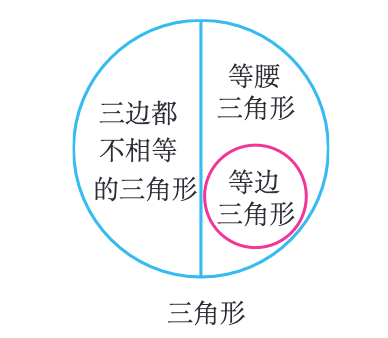

# 第十一章 三角形

## 11.1 与三角形有关的线段

### 11.1.1 三角形的边

1. 由不在同一条直线上的三条**线段**首尾**顺次**相接所组成的图形叫做**三角形**。

2. 线段AB，BC，CA是**三角形的边**。点A，B，C是**三角形的顶点**。∠A，∠B，∠C是相邻两边组成的角，叫做**三角形的内角**，简称**三角形的角**。

3. 顶点是A，B，C的三角形，记作△ABC，读作“三角形ABC”。

4. △ABC的三边，有时也用a，b，c来表示。顶点A所对的边BC用a表示，顶点B所对的边AC用b表示，顶点C所对的边AB用c表示。

5. 三边都相等的三角形叫做**等边三角形**；有两条边相等的三角形叫做**等腰三角形**。

6. 按照三个内角的大小，可以将三角形分为锐角三角形、直角三角形和钝角三角形。

7. 以“是否有边相等”，可以将三角形分为两类：三边都不相等的三角形和等腰三角形。

8. 在等腰三角形中，相等的两边都叫做**腰**，另一边叫做**底边**，两腰的夹角叫做**顶角**，腰和底边的夹角叫做**底角**。

9. **等边三角形是特殊的等腰三角形**，即底边和腰相等的等腰三角形。

10. 三角形按边的相等关系分类如下：
    $三角形\begin{cases}三边都不相等的三角形\\等腰三角形\begin{cases}底边和腰不相等的等腰三角形\\等边三角形\end{cases}\end{cases}$

    

11. **三角形两边的和大于第三边，三角形两边的差小于第三边。**两边的差<第三边<两边的和。
12. 判断三条线段是否能构成三角形，只需判断**两条较短的边的和是否大于第三边**。

### 11.1.2 三角形的高、中线与角平分线

1. 从△ABC的顶点A向它所对的边BC所在直线**画垂线**，垂足为D，所得线段AD叫做△ABC的边BC上的**高**。
   从三角形的一个顶点向它的对边所在直线作**垂线**，**顶点**和**垂足**之间的**线段**叫做三角形的高线，简称**三角形的高**。
2. 三角形三边上的高线相交于一点，叫做垂心。
3. 连接△ABC的顶点A和它所对的边BC的中点D，所得线段AD叫做△ABC的边BC上的**中线**。
   在三角形中，连接一个**顶点**与它**对边的中点**的线段，叫做**三角形的中线**。
4. 中线将三角形一分为二，得到的两部分**面积相等**。
5. 三角形的三条中线相交于一点。三角形三条中线的交点叫做三角形的**重心**。
6. 画∠A的平分线AD，交∠A所对的边BC于点D，所得线段AD叫做△ABC的**角平分线**。
   在三角形中，一个内角的平分线与它的对边相交，这个角的**顶点**与**交点**之间的**线段**叫做**三角形的角平分线**。
7. 普通角的平分线为射线，三角形角平分线为**线段**。
8. 三角形三条角平分线相交于一点，叫做**内心**。

### 11.1.3 三角形的稳定性

1. **三角形具有稳定性**，三角形三条边长确定后，无法改变形状。
2. 三角形是具有稳定性的图形，而四边形没有稳定性。
3. 要使n边形不变形，具有稳定性，要加钉（n-3）根木条。

## 11.2 与三角形有关的角

### 11.2.1 三角形的内角

1. **三角形内角和定理：三角形三个内角的和等于180º。**
2. **直角三角形的两个锐角互余**。
3. 直角三角形可以用符号“Rt△”表示，直角三角形ABC可以写成Rt△ABC。
4. **有两个角互余的三角形是直角三角形。**

### 11.2.2 三角形的外角

1. 三角形的一边与另一边的延长线组成的角，叫做**三角形的外角**。
2. 三角形的外角和等于360º。
3. 推论：**三角形的外角等于与它不相邻的两个内角的和**。
4. 推论：三角形的外角大于任何一个与它不相邻的内角。

## 11.3 多边形及其内角和

### 11.3.1 多边形

1. 在平面内，由一些线段首尾顺次相接组成的封闭图形叫做**多边形**。
2. 三角形是最简单的多边形。
3. 如果一个多边形由n条线段组成，那么这个多边形就叫做**n边形**。
4. 多边形相邻两边组成的角叫做它的**内角**。
5. 多边形的边与它的邻边的延长线组成的角叫做多边形的**外角**。
6. 连接多边形不相邻的两个顶点的线段，叫做多边形的**对角线**。
7. n边形共有$\frac{n(n-3)}{2}$条对角线。
8. 画出四边形ABCD的任何一条边（例如CD）所在直线，整个四边形都在这条直线的同一侧，这样的四边形叫做凸四边形。画出边任何一条边所在直线，整个四边形不都在这条直线的同一侧，这样的四边形叫做凹四边形。
9. 画出多边形的任何一条边所在直线，如果整个多边形都在这条直线的同一侧，那么这个多边形就是**凸多边形**。反之则是**凹多边形**。
10. 凸多边形所有角小于180º。
11. 各个角都相等，各条边都相等的多边形叫做**正多边形**。

### 11.3.2 多边形的内角和

1. 从n边形的一个顶点出发，可以作**（n-３）条对角线**，它们将n边形分为（n-２）个三角形，n边形的内角和等于180º×（n-2）。
   这样就得出了多边形内角和公式：**n边形内角和等于（n-２）×180º**。
2. **多边形的外角和等于360º。**