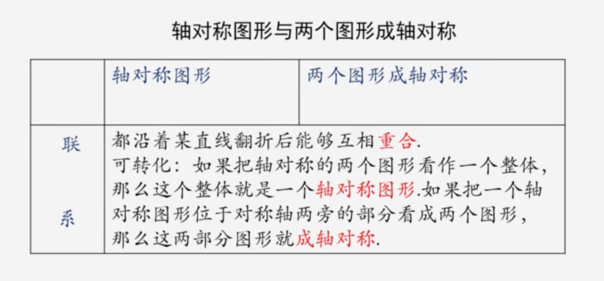
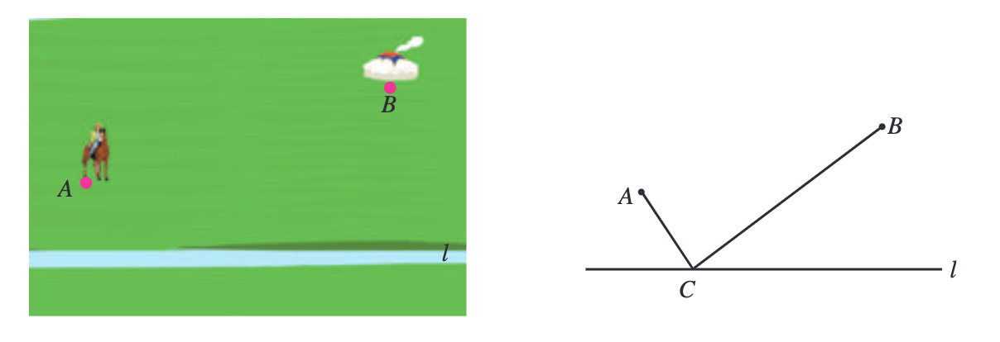
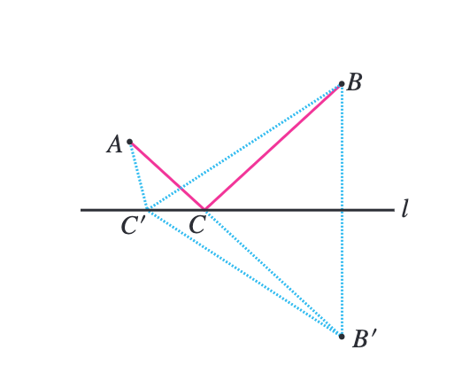
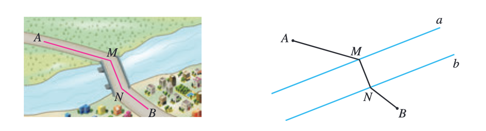
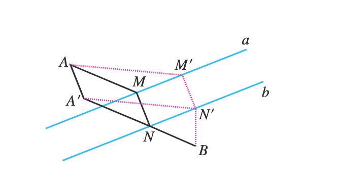

# 第十三章 轴对称

## 13.1 轴对称

### 13.1.1 轴对称

1. 如果一个平面图形沿一条直线折叠，直线两旁的部分能够互相重合，这个图形就叫做**轴对称图形**，这条直线就是它的**对称轴**。这时，我们也说这个图形关于这条**直线（成轴）对称**。

2. 把一个图形沿着某一条直线折叠，如果它能够与另一个图形重合，那么就说这两个图形关于这条直线（成轴）对称，这条直线叫做**对称轴**，折叠后重合的点是对应点，叫做**对称点**。

3. 对应点的连线，总是垂直于对称轴，并且被对称轴平分。

4. 经过线段中点并且垂直于这条线段的直线，叫做这条线段的**垂直平分线**（中垂线）。

5. 轴对称图形与两个图形成轴对称区别

   |            |       轴对称图形       |    两个图形成轴对称    |
   | :--------: | :--------------------: | :--------------------: |
   |    图形    | 一个图形自身的对称特征 | 两个图形之间的对称关系 |
   | 对称点位置 |     在同一个图形上     |      在两个图形上      |
   | 对称轴条数 |        至少一条        |          一条          |

6. 轴对称图形与两个图形成对称轴

   

7. 图形**轴对称的性质**：
   1. 如果两个图形关于某条直线对称，那么对称轴是任何一对对应点所连线段的垂直平分线。
   2. 轴对称图形的对称轴，是任何一对对应点所连线段的垂直平分线。

### 13.1.2 线段的垂直平分线的性质

1. 垂直平分线的性质：**线段垂直平分线上的点与这条线段两个端点的距离相等**。
2. 垂直平分线的判定定理：**与线段两个端点距离相等的点在这条线段的垂直平分线上。**
3. **三角形三边的垂直平分线交于一点。**

## 13.2 画轴对称图形

1. 点（x，y）关于x轴对称的点的坐标为（x，-y）；点（x，y）关于y轴对称的点的坐标为（-x，y）。

## 13.3 等腰三角形

### 13.3.1 等腰三角形

1. 两边相等的三角形是**等腰三角形**。
2. 等腰三角形的性质：
   1. 性质1 **等腰三角形的两个底角相等**（简写成“等边对等角”）；
   2. 性质2 **等腰三角形的顶角平分线、底边上的中线、底边上的高相互重合**（简写成“三线合一”）。
3. 等腰三角形是**轴对称图形**，底边上的中线（顶角平分线、底边上的高）所在直线就是它的对称轴。
4. **等腰三角形的判定方法**：**如果一个三角形有两个角相等，那么这两个角所对的边也相等**（简写成“等角对等边”）。

### 13.3.2 等边三角形

1. 等边三角形是三边都相等的**特殊的等腰三角形**。
2. 由等边三角形的性质和判定方法，可以得到：
   1. **等边三角形的三个角都相等，并且每一个角都等于60º**。
   2. **三个角都相等的三角形是等边三角形**。
   3. **有一个角是60º的等腰三角形是等边三角形**。
3. 三边上高都相等的三角形是等边三角形。
4. #### 含30º角的直角三角形的性质

   1. **在直角三角形中，如果一个锐角等于30º，那么它所对的直角边等于斜边的一半**。

5. **大边对大角，大角对大边**。

## 13.4 课题学习 最短路径问题

1. 两点的所有连线中，线段最短。
2. 连接直线外一点与直线上各点的所有线段中，垂线段最短。
3. 在解决最短路径问题时，我们通常利用轴对称、平移等变化把已知问
   题转化为容易解决的问题，从而作出最短路径的选择．

### 问题1 

如图，牧马人从A地出发，到一条笔直的河边l饮马，然后到B地。牧马人到河边的什么地方饮马，可使所走的路径最短？

如果把河边l近似地看成一条直线，C为直线l上的一个动点，那么，上面的问题可以转化为：当点C在l的什么位置时，AB与CB的和最小。

如图，作出点B关于l的对称点B'，利用轴对称的性质，可以得到CB'=CB。这样，问题就转化为：当点C在l的什么位置时，AC与CB'的和最小？

如图，在连接A，B'两点的线中，线段AB'最短。因此，线段AB'与直线l的交点C的位置即为所求。

### 问题２

（造桥选址问题）如图，A和B两地在一条河的两岸，现要在河上造一座桥MN。桥造在何处可使从A到B的路径AMNB最短？（假定河的两岸是平行的直线，桥要与河垂直。）

我们可以把河的两岸看成两条平行线a和b，N为直线b上的一个动点，MN垂直于直线b，交直线a于点M，这样，上面的问题可以转化为下面的问题：当点N在直线b的什么位置时，AM＋MN＋NB最小？

如图，将AM沿与河岸垂直的方向平移，点M移动到点N，点A移动到点A'，则AA'=MN，AM+NB=A'N+NB。这样，问题就转化为：当点N在直线b的什么位置时，A'N＋NB最小？

如图，在连接A'，B两点的线中，线段A'B最短。因此，线段A'B与直线b的交点N的位置即为所求，即在点N处造桥MN，所得路径AMNB是最短的。

### 归纳：

​	在解决最短路径问题时，我们通常利用轴对称、平移等变化把已知问题转化为容易解决的问题，从而作出最短路径的选择。