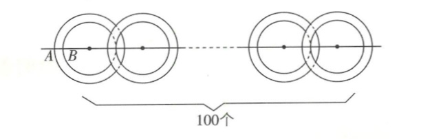
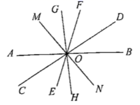

# 数学错题2

1. 下列说法正确的是(   )
   A. 线段AB和线段BA表示的不是同一条线段

   B. 射线AB和射线BA表示的是同一条射线

   C. 若点P是线段AB的中点，则PA=$\frac12$AB

   D. 线段AB 叫做A,B两点间的距离

**答案**：C.线段AB和线段BA表示的是同一条线段，故A错误；射线AB和射线BA表示的不是同一条射线，故B错误；由线段中点的定义可知C正确；线段AB的长度叫做A,B两点间的距离，故D错误. 故选C.

2. 下列说法正确的有(   )

   ①正有理数是正整数和正分数的统称；②整数是正整数和负整数的统称；③有理数是正整数、负整数、正分数、负分数的统称；④0是偶数，但不是自然数；⑤偶数包括正偶数，负偶数和零.

   A. 1个    B. 2个    C. 3个    D. 4个

**答案**：B.①正有理数是正整数和正分数的统称，正确；②整数是正整数、0和负整数的统称，原来的说法是错误的；③有理数是正整数、0、负整数、正分数、负分数的统称，原来的说法是错误的；④0是偶数，也是自然数，原来的说法是错误的；⑤偶数包括正偶数、负偶数和零，正确.故说法正确的有2个.故选B.

0是偶数：能被2整除的整数叫做偶数，0除以2等于0，商是整数，没有余数，所以0能被2整除，符合偶数的定义。

0是自然数：自然数是用以计量事物的件数或表示事物次序的数，即用数码 0，1，2，3，4....所表示的数。从历史上看，国内外数学界对于0是否为自然数曾有过不同的观点，现在，国际标准和中国国家标准都规定0是自然数。

3. 已知圆环内直径为acm，外直径为bcm，将100个这样的圆环一个接一个地套成一条锁链（无缝隙），那么这条锁链拉直后的长度为__cm。

**答案**：（99a+b）【解析】如图，圆环的宽度AB=$\frac{b-a}{2}$cm，因此100个这样的圆环拉紧后的长度为$\frac{b-a}{2}+100a+\frac{b-a}{2}=(99a+b)$cm。故答案为（99a+b）。

4. 某商家对玫瑰、康乃馨、茉莉花（分别记为A、B、C）进行搭配销售，推出甲、乙两种盒装鲜花，其中盒装鲜花的成本是盒中所有A、B、C的成本之和。每盒甲由3束A，1束B，1束C组成；毎盒乙由2束A，4束B，4束C组成。每盒甲中所有A、B、C的成本之和是1束A成本的15倍，每盒乙的利润率为20%，每盒乙的售价比每盒甲的售价高20%。该商家在“双十一”期间销售这两种盒装鲜花的总销售额为99200元，总利润率为24%，则销售甲种盒装鲜花的总利润是__元。

**答案**：3500【解析】设A的成本为x元/束，B的成本元/束，C的成本z元/束。依题意有3x+y+z=15x，则y+z=12x。每盒乙的成本为2x+4y+4z=2x+48x=50x元，则每盒甲、乙的成本的比为15x：50x=3：10。
设每盒甲的成本为m元，则每盒乙的成本为$\frac{10}{3}$m元。根据题意，每盒乙的售价为$(1+20\%)×\frac{10}{3}m=4m$元，则每盒甲的售价为$\frac{10}{3}$m元。
设销售甲a盒，销售乙b盒，则$\frac{10}{3}ma+4mb=(1+24\%)·(ma+\frac{10}{3}mb)$，解得$b=\frac{157}{10}a$。
由$\frac{10}{3}ma+4mb=99200$，得\frac{10}{3}ma+4x\frac{157}{10}ma=99200，解得ma=1500，则销售甲种盒装鲜花的总利润是$\frac{10}{3}ma-ma=\frac73ma=3500$（元）。
故销售甲种盒装鲜花的总利润是3500元。故答案为3500。

5. 某工厂生产一批零件，规定零件的长度允许有0.1cm的误差，现检验员随机抽查了5个零件，超过规定长度的厘米数记为正，不足规定长度的厘米数记为负，检查结果如下表：

   | 零件编号   | 1     | 2     | 3     | 4     | 5     |
   | ---------- | ----- | ----- | ----- | ----- | ----- |
   | 数据（cm） | -0.09 | +0.13 | +0.05 | -0.12 | -0.04 |

（1）指出哪些零件是合格产品（即在规定误差范围内）；

（2）在合格的产品中，几号零件的质量最好？为什么？

**答案**：【解】（1）因为合格零件的长度允许有0.1cm的误差，所以編号1,3,5的零件是合格品。

（2）因|-0.04|<|+0.05|<|-0.09|，所以5号产品的质量最好。理由：因为绝对值越小，误差越小，质量越好，反之，质量越差。

6. 如图所示，直线AB,CD,EF,MN,GH相交于点O，则图中对顶角共有__对。

**答案**：20【解析】2条直线交于一点，对顶角有2对，2=2×1；3条直线交于一点，对顶角有6对，6=3×2；4条直线交于一点，对顶角有12对，12=4×3。由规律可得，n（n≥2且n为整数）条直线交于一点，可以得到n(n-1)对对顶角，所以直线AB,CD,EF,MN,GH相交于点O，对顶角共有5×4=20（对），故答案为20。

7. 在平面内，若2条直线的最多交点数记为$a_1$，3条直线的最多交点数记为$a_2$，4条直线的最多交点数记为$a_3$，...，以此类推，则$\frac{1}{a_1}+\frac{1}{a_2}+\frac{1}{a_3}+...+\frac{1}{a_10}$=__。

**答案**：$\frac{20}{11}$【解析】因为2条直线最多有1个交点，3条直线最多有（1+2）个交点，4条直线最多有（1+2+3）个交点，⋯，所以n条直线最多有（1+2+3+…+n-1）个交点，即$\frac{n(n-1}{2}$个（n为大于等于2的正整数），所以$\frac{1}{a_1}+\frac{1}{a_2}+\frac{1}{a_3}+...+\frac{1}{a_{10}}$=$\frac{1}{\frac{2×1}{2}}+\frac{1}{\frac{3×2}{2}}+\frac{1}{\frac{4×3}{2}}+...+\frac{1}{\frac{11×10}{2}}$=$\frac{2}{2×1}+\frac{2}{3×2}+\frac{2}{4×3}+...+\frac{2}{11×10}$=$2×(1-\frac{1}{2}+\frac{1}{2}-\frac{1}{3}+\frac{1}{3}-\frac{1}{4}...+\frac{1}{10}-\frac{1}{11})$=$2×\frac{10}{11}$=$\frac{20}{11}$。故答案为$\frac{20}{11}$。