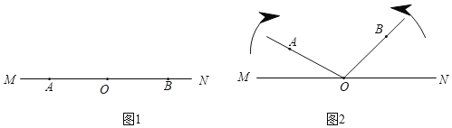
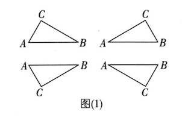
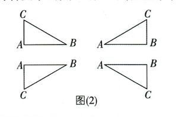
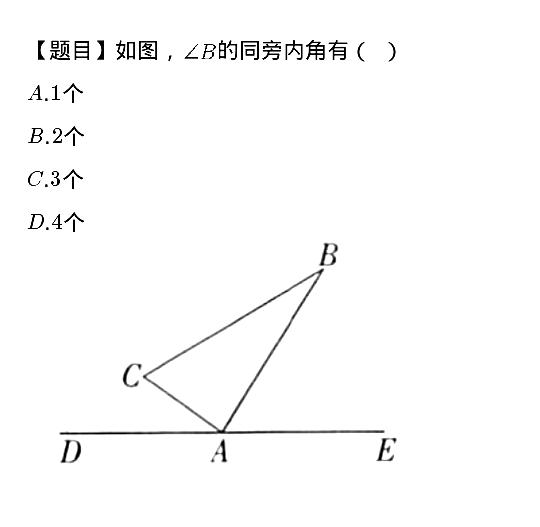
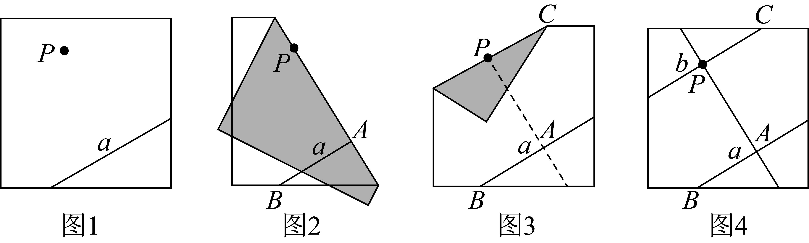
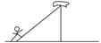

# 数学错题3

1. 两条直线相交构成四个角，给出下列条件：①有一个角是直角；②有一对对顶角互补；③三个角相等；④有一组邻补角相等，其中能判定这两条直线互相垂直的有（   ）

   A.4个    B.3个    C.2个    D.1个

**答案：**A【解析】两条直线相交构成四个角，①有一个角是直角，能判定这两条直线互相垂直；②有一对对顶角互补，根据对顶角相等，可得这一对对顶角都是90°，能判定这两条直线互相垂直；③ 有三个角相等，则每个角都等于90°，能判定这两条直线互相垂直；④有一组邻补角相等，则这两个角都为90°，能判定这两条直线互相垂直。所以能判定这两条直线互相垂直的有①②③④，共有4个。故选 A。

2. 如图（1），点A,O,B依次在直线MN上，现将射线OA绕点O沿顺时针方向以每秒4°的速度转动，同时射线0B绕点O沿逆时针方向以每秒6°的速度转动，直线MN保持不动，如图（2），设转动时间为t秒（0≤t≤60）。
   （1）当t=3时，求∠AOB的度数；

   （2）在转动过程中，当∠AOB第二次达到80°时，求t的值；

   （3）在转动过程中是否存在这样的t，使得射线OB与射线OA垂直？如果存在，请求出t的值；如果不存在，请说明理由。

**答案：**【解】（1）当t=3时，∠AOB=180º-4ºx3-6°x3=150°。

（2）依题意，得4t+6t=180+80，解得t=26。答：当∠AOB第二次达到80°时，t的值为26。

（3）存在。令4t+6t=180，解得t=18。当0≤t≤18时，180-4t-6t=90，解得t=9；当18<t≤60时，4t+6t=180+90或4t+6t=180+270，解得t=27或t=45。答：在转动过程中存在这样的t，使得射线OB与射线 0A 垂直，t的值为9或27或45。

3. 同一平面内有A,B,C三点，A,B两点之间的距离为5cm，点C到直线AB的距离为2cm，且三角形ABC为直角三角形，则满足条件的点C有几个？

**答案：**【解】满足条件的点C有8个。

①若AC⊥BC，点C到AB的距离为2cm，即AB边上的高为2cm，符合要求的点C有4个，如图（1）。

②若AC⊥AB，则AC=2cm，若 AB⊥BC，则BC=2cm，符合要求的点C有4个，如图（2）。

综上，满足条件的点C有8个。

4. 如图，∠B的同旁内角有（   ）

   A.4个    B.3个    C.2个    D.1个

**答案：**B【解析】因为∠BAC和∠B在截线AB的同侧，且都在被截直线AC,BC的内侧，所以∠BAC和∠B是同旁内角。因∠C和∠B在截线BC的同侧，且都在被截直线AC,AB的内侧，所以∠C和∠B是同旁内角。因为∠BAF和∠B在截线AB的同侧，且都在被截直袋AF,BC的内侧，所以∠BAF和∠B是同旁内角。所以∠B的同旁内角有3个。故选 B。

5. 在探究“过直线外一点P作已知直线a的平行线”的活动中，王玲同学通过如下的折纸方式找到了符合要求的直线，在这个过程中她可能用到的推理依据组合是（   ）

   ①平角的定义；②邻补角的定义；③角平分线的定义；④同旁内角互补，两直线平行；⑤两直线平行，內错角相等。

   A.②④    B.③⑤    C.①②⑤    D.①③④

**答案：**D【解析】如图，设直线PA与纸片的边相交于点M，直线AB与纸片的边交于点H。第一次对折后，射线AH与射线AB重合，由平角的定义及角平分线的定义可得∠PAB=∠PAH=90°。第二次对折后，射线PM和射线PA重合。同理可得∠MPC=∠APC=90°，∴∠CPA+∠PAH=180°。由同旁内角互补，两直线平行可得b∥a。故选D。

6. 如图，一只小猴顺着一根斜放的竹竿往上爬，眼睛一直盯着挂在上端的帽子。在小猴爬行的过程中，视线与水平方向所成角（   ）

   A. 逐渐变大    B. 逐渐变小    C. 没有变化    D. 无法确定

**答案：**C【解析】∵在小猴爬行的过程中，视线与水平方向所成的角等于竹竿与地面的夹角，∴视线与水平方向所成角不变。
