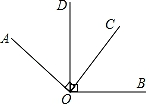
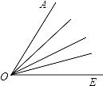

# 数学错题4

1. 阅读下面材料，解答问题：
   【问题情境】数学活动课上，老师带领同学们开展“运用规律求一个正数的算术平方根”的实践活动。
   【实践探究】同学们利用计算器计算出下表中的算术平方根，整理数据如下：

   | $\sqrt{0.0625}$ | $\sqrt{0.625}$ | $\sqrt{6.25}$ | $\sqrt{62.5}$ | $\sqrt{625}$ | $\sqrt{6250}$ | $\sqrt{62500}$ |
   | --------------- | -------------- | ------------- | ------------- | ------------ | ------------- | -------------- |
   | 0.25            | 0.791          | 2.5           | 7.91          | 25           | 79.1          | 250            |

（1）根据上述探究，可以得到被开方数和它的算术平方根之间小数点的变化规律：若被开方数的小数点向右或向左移动2位，则它的算术平方根的小数点就相应地向右或向左移动__位。

（2）已知$\sqrt{3}≈1.732$，请运用上述规律直接写出下列各式的值：$\sqrt{0.03}≈\_\_\_\_$，$\sqrt{300}≈\_\_\_\_$。

（3）你能根据$\sqrt{3}$的值说出$\sqrt{30}$的值是多少吗？请说明理由。

**答案：**【解】（1）由表中规律可知，若被开方数的小数点向右或向左移动2位，则它的算术平方根的小数点就相应地向右或向左移动1位。故答案为1。

（2）∵$\sqrt{3}≈1.732$，∴$\sqrt{0.03}≈0.1732$，$\sqrt{300}≈17.32$。故答案为0.1732，17.32。

（3）不能根据$\sqrt{3}$的值说出$\sqrt{30}$的值。理由如下：由（1）知若被开方数的小数点向右或向左移动2位，则它的算术平方根的小数点就相应地向右或向左移动1位，但$\sqrt{3}$到$\sqrt{30}$中，被开方数的小数点向右移动了1位，不满足变化规律，∴无法由$\sqrt{3}$的值说出$\sqrt{30}$的值。

2. $\sqrt[3]{216}$的立方根是__。

**答案：**$\sqrt[3]{6}$。

3. “9的算术平方根”这句话用数学符号表示为（   ）

   A.$\sqrt{9}$    B. ±$\sqrt{9}$    C.$\sqrt{3}$    D. ±$\sqrt{3}$

**答案：**A

4. 若m是$\sqrt{16}$的算术平方根，则m+3=__。

**答案：**5

5. M是个位数字不为零的两位数，将M的个位数字与十位数字互换后，得另一个两位数N，若M-N恰是某正整数的立方，则这样的M共有__个。

**答案：**6【解析】设两位数M=10a+b，则N=106+a。∴a,b是正整数，且1≤a≤9，1≤b≤9，M-N是某正整数的立方，∴设$M-N=(10a+b)-(10b+a)=9(a-b)=c^3$。∵c是正整数，且易知$0<c^3≤72$，∴0<c≤4。又$c^3$是9的倍数，∴c=3，即a-b=3，满足条件的M有41,52,63,74,85,96，共6个。故答案为6。

6. 如图，已知∠AOC和∠BOD都是直角，设图中互补的角有m对，互余的角有n对，则m+n的值为（   ）
   A.2    B.3    C.4    D.5

**答案：**C【解析】因∠AOC和∠BOD都是直角，所以∠AOC+∠BOD=90°+90°=180°，∠AOD+∠COD=∠BOC+∠COD=90°，所以∠AOB+∠COD=180°，所以m=2，n=2，所以m+n=4。故选C。

7. 如图，在∠AOE的内部从O引出3条射线，那么图中共有\_\_个角；引出5条射线，共有\_\_个角；引出n条射线，共有\_\_个角。

**答案：**10 21 $\frac12(n+1)(n+2)$【解析】如果引出3条射线，那么题图中共有10个角；如果引出5条射线，共有21个角；如果引出n条射线，共有$\frac12(n+1)(n+2)$个角。

8. 如图，射线OB,OC在∠AOD内部，其中OB为∠AOC的三等分线，OE,OF分別平分∠BOD和∠COD，若∠EOF＝14°，请直接写出∠AOC的大小。

**答案：**【解】①当∠AOC=3∠BOC时，设∠BOC=x，∠DOF=y。

因为OB为∠AOC的三等分线，OF平分∠COD，所以∠AOC=3x，∠COD=2y，所以∠BOD=x+2y。

因为OE平分∠BOD，所以∠EOD=$\frac{1}{2}$∠BOD=$\frac12$x+y。

因为∠EOF=14°，所以$\frac12$x+y-y=14°，解得x=28°，故∠AOC=3x=84°。

②当∠AOC=$\frac23$∠BOC时，设∠BOC=2m，∠DOF=n。

因为OB为∠AOC的三等分线，OF平分∠COD，所以∠AOC=3m，∠COD=2n，所以∠BOD=2m+2n。

因为OE平分∠BOD，所以∠EOD=$\frac12$∠BOD=m+n。

因∠EOF=14°，所以m+n-n=14°，解得m=14°，故∠AOC=3m=42°。

综上，∠AOC=84°或42°。