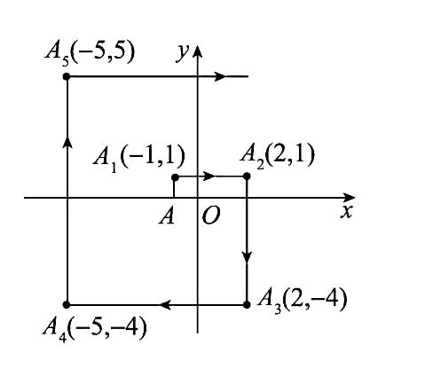
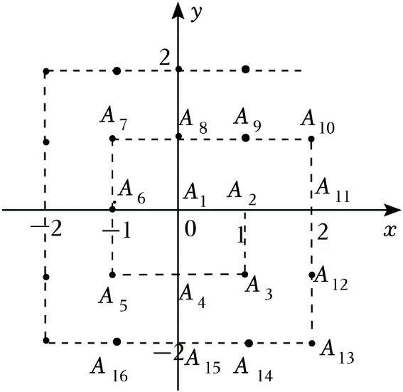
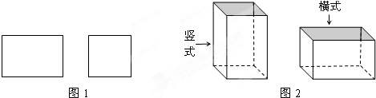

# 数学错题5

1. 若点P（a,a-5）到x轴的距离为$m_1$，到y轴的距离为$m_2$。
   （1）当a=1时，$m_1+m_2$=__；

   （2）若$m_2+m_1=7$，求出点P的坐标。

**答案：**【解】（1）当a=1，P（1,-4），∴$m_1$=4，$m_2$=1，$m_1+m_2$=5。故答案为5。

（2）∵$m_1+m_2$=7,∴|a-5|+|a|=7。

①当a<0时，-a-a+5=7，解得a=-1，∴P（-1,-6）。

②当0≤a≤5时，a-a+5=7，无解，∴舍去。

③当a>5时，a+a-5=7，解得a=6，∴P（6,1）。

综上所述，点P的坐标为（-1,-6）或（6,1）。

2. 如图所示，在平面直角坐标系中，将点A（-1,0）作如下的连续平移，A（-1,0）→$A_1$（-1,1）→$A_2$（2,1）→$A_3$（2,-4）→$A_5$（-5,5）→...，按此规律平移下去，则点$A_{102}$的坐标是（   ）

   A.（100,101）    B.（101,100）    C.（102,101）    D.（103,102）

**答案：**C【解析】由题意可知，将点A（-1,0）向上平移1个单位长度得到A（-1,1），再向右平移3个单位长度得到$A_2$（2,1），再向下平移5个单位长度得到$A_3$（2,-4），再向左平移7个单位长度得到$A_4$（-5,-4），再向上平移9个单位长度得到$A_5$（-5,5），⋯。∵102÷4=25...2，$A_2$（2,1）,$A_6$（6,5）,$A_{10}$（10,9）,...,以此类推，∴$A_{4n+2}$（4n+2,4n+1），点$A_{102}$的坐标是（102,101）。故选C。

3. 数学家高斯推动了数学科学的发展，被数学界誉为“数学王子”，据传，他在计算1+2+3+4+…+100时，用到了一种方法，将首尾两个数相加，进而得到1+2+3+4+...+100=$\frac{100×(1+100)}{2}$。人们借助于这样的方法，得到1+2+3+4+...＋n=$\frac{n×(1+n)}{2}$（n是正整数）。有下列问题，如图，在平面直角坐标系中的一系列格点$A_i（x_i，y_i）$，其中i=1，2，3，n，...，且$x_i$，$y_i$是整数。记$a_n=x_n+y_n$，如$A_1$（0，0），即$a_1$=0，$A_2$（1，0），即$a_2$=1，$A_3$（1，-1），即$a_3=0$，…，以此类推。则下列结论正确的是（   ）

   A.$a_{2023}=40$    B.$a_{2024}=43$    C.$a_{(2n-1)^2}=2n-6$    D.$a_{(2n-1)^2}=2n-4$

**答案：**B【解析】第1圈有1个点，即$A_1$（0，0），这时$a_1$=0；第2圏有8个点，即$A_2$到$A_9$（1，1），这时$a_9$=1+1=2；第3圏有16点，即$A_10$到$A_25$（2，2），这时$a_25$=2+2=4；…以此类推，第n圏，$A_{(2n-1)^2}$（n-1，n-1）。由规律可知$A_{2023}$是在第23圏上，且$A_2025$（25，25），则$A_{2023}$（20，22），即$a_{2023}$=20+22=42，故选项A不正确；$A_{2024}$是在第23圈上，且 $A_{2024}$（21，22），则$a_{2024}$=21+22=43，故选项B正确；∵$A_{(2n-1)^2}$（n-1，n-1），∴$a_{(2n-1)^2}$=2n-2，故选项C，D不正确。故选B。

4. 若一个四位正整数abcd满足：a+c=b+d，我们就称该数是“平衡数”。如对于四位数3564，因为3+6=5+4，所以3564是“平衡数”；对于四位数2356，因为2+5≠3+6，所以2356不是“平衡数”。

   （1）最小的“平衡数”是\_\_，最大的“平衡数”是\_\_；

   （2）判断7128是否为“平衡数”，并说明理由；

   （3）若一个“平衡数”满足千位数字与百位数字的积是12，且十位数字与个位数字的和为6，请你写出所有满足条件的“平衡数”。

**答案：**【解】（1）a取最小的正整数1，c取最小的整数0，∵a+c=b+d，∴当b=0，d=1时，有最小的“平衡数”，为1001，同理，当a=c=9时，b=d=9，有最大的“平衡数”，为9999，故答案为1001，9999。

（2）7128是“平衡数”。理由如下：∵a=7，b=1，c=2，d=8，∴a+c=b+d=9，∴7128是“平衡数”。

（3）设该“平衡数”为abcd。由题意得ab=12，c+d=6，1≤a≤9，b，c，d均为大于等于0且小于等于9的整数，∴a，b能取得的值为$\begin{cases}a=2\\b=6\end{cases}$，$\begin{cases}a=3\\b=4\end{cases}$，$\begin{cases}a=4\\b=3\end{cases}$，$\begin{cases}a=6\\b=2\end{cases}$。①当a=2，b=6时，∵a+c=b+d，c+d=6，с=5，d=1，此时“平衡数”为2651；②当a=3，6=4时，∵a+c=b+d，c+d=6，∴c=$\frac72$，d=$\frac52$（舍去）；③当a=4，b=3时，∴a+c=b+d，c+d=6，∴c=$\frac52$，d=$\frac72$（舍去）；④当a=6，b=2时，∵a+c=b+d，c+d=6，∴c=1，d=5，此时“平衡数”为6215。综上：满足条件的“平衡数”有2651和6215。

5. 某铁件加工厂用如图（1）的长方形和正方形铁片（长方形的宽与正方形的边长相等）加工成如图（2）的竖式与横式两种无盖的长方体铁容器（加工时接缝材料忽略不计）。

   （1）现有长方形铁片2014张，正方形铁片1176张，如果将两种铁片刚好全部用完，则可加工的竖式和横式长方体铁容器各有多少个？

   （2）把长方体铁容器加盖可以加工成铁盒。现工厂准备将35块铁板裁剪成长方形铁片和正方形铁片，用来加工铁盒，已知1块铁板可裁成3张长方形铁片或4张正方形铁片，也可以裁成1张长方形铁片和2张正方形铁片。问：该工厂充分利用这35张铁板，最多可以加工成多少个铁盒？

   

**答案：**【解】（1）设可以加工竖式长方体铁容器x个，横式长方体铁容器y个。

依题意，得$\begin{cases}4x+3y=2014\\x+2y=1176\end{cases}$，解得$\begin{cases}x=100\\y=538\end{cases}$。

答：可以加工竖式长方体铁容器100个，横式长方体铁容器538个。

（2）设将m块铁板单独裁成长方形铁片，n块铁板单独裁成正方形铁片，则用（35-m-n）块铁板同时裁成长方形铁片和正方形铁片。

依题意，得$\frac{3m+(35-m-n)}{4}=\frac{4n+2(35-m-n)}{2}$，∴n=$\frac65$m-21。

∵m，n，（35-m-n）均为非负数，

∴$\begin{cases}m=25\\n=9\end{cases}$，或$\begin{cases}m=20\\n=3\end{cases}$。

当m=25，n=9时，$\frac{3m+(35-m-n)}{4}=\frac{3×25+(35-25-3)}{4}=19$；

当m=20，n=3时，$\frac{3m+(35-m-n)}{4}=\frac{3×20+(35-20-3)}=18$。

∵19>18，∴最多可以加工成19个铁盒。

6. 重阳佳节来临之际，某糕点店对桂圆味、核桃味、绿豆味的重阳糕（分别记为A、B、C）进行混装，推出了甲、乙两种盒装重阳糕，盒装重阳糕的成本是盒中所有A、B、C的成本与包装盒成本之和，每盒甲装有6个A、2个B、2个C，每盒乙装有2个A、4个B、4个C，每盒甲中所有A、B、C的成本之和是1个A成本的15倍，每个乙的包装盒成本是每个甲的包装盒成本的$\frac43$。每盒乙的利润率为20%，每盒乙的售价比每盒甲的售价高20%。当该店销售这两种盒装重阳糕的总销售额为31000元，总利润率为24%时，销售甲种盒装重阳糕的总利润是__元。

**答案：**2500【解析】设A的成本为x元，B的成本为y元，C的成本为z元，甲的销售量为a盒，乙的销售量为b盒。由题意可知，甲每盒装的重阳糕的成本是15x=6x+2y+2z，化简得y+z=4.5x，乙每盒装的重阳糕的成本是2x+4y+4z=2x+4(y+z)=2x+4×4.5x=20x。∵$\frac{20x}{15x}$=$\frac43$，每个乙的包装盒成本是每个甲的包装盒成本的$\frac43$，每盒乙的成本是每盒甲的成本的$\frac43$。设每盒甲的成本为m元，则每盒乙的成本为$\frac43$m，则每盒乙的售价为$\frac43$m（1+20%）=1.6m。∵每盒乙的售价比每盒甲的售价高20%，∴每盒甲的售价为$\frac{1.6m}{1+20%}=\frac43m$​。根据甲、乙的利润得$(\frac43m-m)a+(1.6m-\frac43m)b=(ma+\frac43mb)×24\%$，化简得$\frac{7}{75}ma=\frac{4}{75}mb$，∴b=$\frac74$a。∵$\frac43$ma+1.6mb=31000，∴$\frac43$ma+1.6m×$\frac74$a=31000，∴ma=7500，∴销售甲种盒装重阳糕的总利润是$\frac43$ma-ma=$\frac13$ma=$\frac13$×7500=2500（元）。故答案 2 500。

7. m为正整数，已知二元一次方程组$\begin{cases}mx+2y=10\\3x-2y=0\end{cases}$，有整数解，则$m^2$-1的值为（   ）

   A.3或48    B.3    C.4或49    D.48

**答案：**B【解析】$\begin{cases}mx+2y=10，①\\3x-2y=0，②\end{cases}$①+②得(m+3)x=10，解得x=$\frac{10}{m+3}$。把x=$\frac{10}{m+3}$代入②得y=$\frac{15}{m+3}$。由方程组有整数解，得m+3=±1或m+3=±5，解得m=-2，-4，2，-8。由m为正整数，得m=2，则$m^2$-1=4-1=3。故选B。