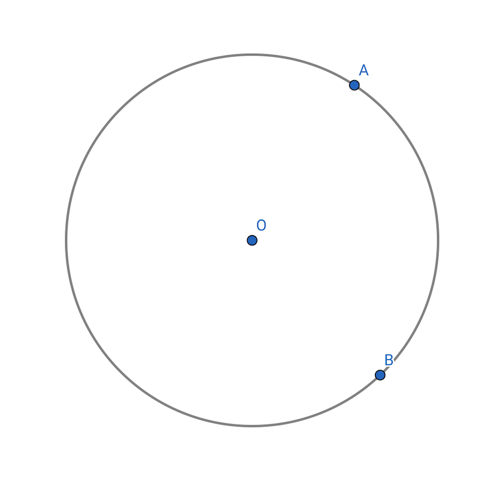
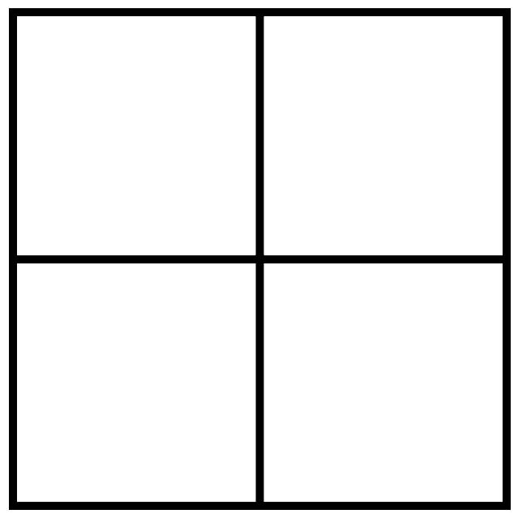
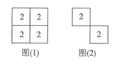
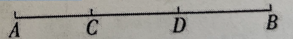
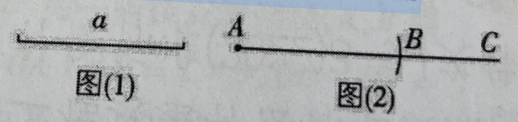

# 数学错题本1

1. 已知关于$x$的一元一次方程$x-\frac{3-ax}{6}=\frac{x+3}{2}-1$的解是偶数，则符合条件的所有整数$a$的和为(   )
   A。-12    B。-14    C。-20    D。-32
   **解析**：由$x-\frac{3-ax}{6}=\frac{x+3}{2}-1$得$6x-(3-ax)=3(x+3)-6$，解得$x=\frac{6}{3+a}$。因为$x$的值是偶数，且$a$为整数，所以$3+a$的值可能为1，3，-1，-3，所以a的值可能为-2，0，-4，-6，所以符合条件的所有整数$a$的和是-2+0-4-6=-12。故选A。

2. 如图，已知一周长为30cm的圆形轨道上有相距10cm的A，B两点（备注：圆形轨道上两点间的距离是指圆上这两点间的较短部分展直后的线段长）。动点P从A点出发，以7cm/s的速度在轨道上沿逆时针方向运动，与此同时，动点Q从B点出发，以5cm/s的速度按同样的方向运动。设运动时间为ts，在P，Q第二次相遇前，当动点P，Q在轨道上相距14cm时，则t=___。

   

   **解析**：共有四种情况：①$7t+10-5t=14$，解得$t=2$；②$7t+10-5t=16$，解得$t=3$；③$7t+10-5t=44$，解得$t=17$；④$7t+10-5t=46$，解得$t=18$。综上所知，$t＝2，3，17或18$。故答案为$2，3，17或18$。

3. 一个几何体由几个大小相同的小立方体搭成，从正面和左面观察这个几何体，看到的形状都一样(如图所示)，则这个几何体最少有---个小立方体，最多有---个小立方体。
   
   解析：①若从上面看到的图形如图（1)所示，该图形上的数字表示该位置摆放小立方体的个数，其从正面看、从左面看得到的图形符合题意，此时，需要的小立方体的个数最多，为8个；②若从上面看到的图形如图（2)所示，该图形上的数字表示该位置摆放小立方体的个数，其从正面看、从左面看得到的图形符合题意，此时，需要的小立方体的个数最少，为4个。故答案 4，8。
   

4. 平面上不重合的两点确定一条直线，不重合的三点最多可以确定3 条直线，则平面内不重合的七个点最多可以确定的直线条数是(   )

   A。42    B。35    C。30    D。21

   解析：平面上不重合的两点确定1条直线；不重合的三点最多可以确定3条直线；不重合的四个点最多可以确定(1+2+3)条直线；不重合的五个点最多可以确定(1+2+3+4)条直线⋯⋯所以平面上不重合的七个点最多可以确定1+2+3+4+5+6=21（条）直线，故选D。

5. 小刚和小强在争论一道几何问题，问题是射击时为什么枪管上有准星。小刚说：“过两点有且只有一条直线，所以枪管上才有准星。“小强说：“过两点有且只有一条直线我当然知道，可是若将人眼看成一点，准星看成一点，目标看成一点，这样不是有三点了吗？既然过两点有且只有一条直线，那弄出第三点是为什么呢？”聪明的你能回答小强的疑问吗？

   解：如果将人眼看成一点，准星看成一点，目标看成一点，那么要想射中目标，人眼与目标确定的这条直线应与子弹所走的直线重合，即与准星和目标所确定的这条直线重合，即可看到哪儿打到哪儿。
   换句话说要想射中目标就必须使准星在人眼与目标所确定的直线上。

6. （1）观察思考：如图，线段AB上有两个点C，D，分别以点A，B，C，D端点的线段共有---条。

   （2）模型构建：若线段上有m个点（包括端点），则共有---条线段。

   （3）拓展应用：若有8位同学参加班级的演讲比赛，比赛采用单循环制（即每两位同学之间都要进行一场比赛），根据上述模型，求一共要进行多少场比赛。
   
   解析：（1)因为以点A为左端点的线段有线段AB，AC，AD，以点C为左端点的线段有线段CD，CB，以点D为左端点的线段有线段DB，所以共有3+2+1=6（条)线段。故答案为6。

   （2）若线段上有m个点（包括端点），则共有$(m-1)+(m-2)+(m-3)+···+3+2+1=\frac12m(m-1)$（条）线段。故答案为$\frac12m(m-1)$。

   （3）把8位同学看成直线上的8个点，每两位同学之间的一场比赛看成一条线段，由题知，当m=8时，$\frac{m(m-1)}{2}=\frac{8(8-1)}{2}=28$。答：一共要进行28场比赛。

7. 已知：线段a，如图（1）。求作：线段AB，使AB=a。在下面的作法中，有些地方叙述稍显笼统，请找出来，并加以改正。

   作法：如图（2），①作射线AC；②以点A为一端，作线段AB=a。AB就是所求作的线段。

   

   解析：作法的叙述中第②步太笼统，没交代清楚。这一步正确作法为以点A为圆心，以线段$a$的长为半径画弧，交射线AC于点B。线段AB即为所求。或者是用圆规在射线AC上截取AB=a，线段AB即为所求。